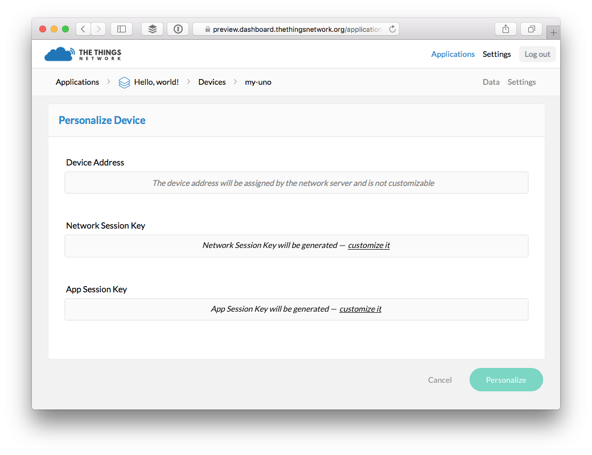

# Register Device

To communicate with the Application you registered via The Things Dashboard, we first need to do the same for your Device and activate it via our sketch.

> To register you'll need to [get the **Dev EUI** of your device](/uno/#get-your-dev-eui) first.

1.  Form the application page, select **Devices** from the top right menu.
2.  In the **Devices** box, click **register device**.

    * For **Device ID**, choose a - for this application - unique ID of lower case, alphanumeric characters and nonconsecutive `-` and `_`.
    * For **Device EUI**, copy-paste the **DevEUI** you retrieved from your device.

    	> If you plan to switch to ABP anyway, just leave it to be generated.
    
    * Leave the **App Key** to be randomly generated.
    * For **App EUI**, select the generated EUI from the list.

    

4.  Click **Register** to finish.

    You will be redirected to the newly registered device where you can find the generated **App Key** needed to activate the device.

## Personalise device for ABP

Normally, you'd use Over The Air Activation (OTAA) to negotiate session keys for further communication. You have the option to personalise a device, which means you will generate or assign session keys manually and use hard code them on the device.

> In production, you'll want to use OTAA. This is more reliable because the activation will be confirmed and more secure because the session keys will be negotiated with every activation. ABP is useful for workshops because you don't have to wait for a downlink window to become available to confirm the activation.

1.  In the dashboard, go to the device you'd like to personalise.
2.  From the top right menu, select **Settings**.
3.  Click on **personalize device**, just right of the **Device Settings** header.

    * Leave the **Network Session Key** and **App Session Key** to be generated for you or click **customize it** if you'd like to set them yourself.

    
    
5.  Click **Personalize** to finish.

    You will be redirected back to the device, where you will find the **Device Address** and session keys needed to activate the device.
