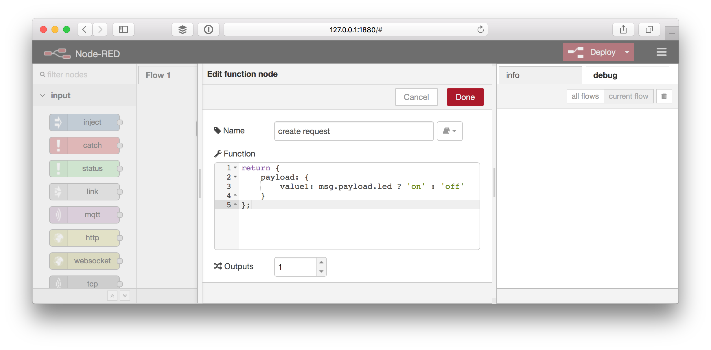

# Build flows

Node-RED allows you to build all kinds of flows with basic business logic. You can add switches, triggers, custom functions and install thousands of nodes with additional functionality, for example storing data in a database.

You can find a lot of example flows and additional nodes in the [Node-RED Library](http://flows.nodered.org/)

## Example: IFTTT
A common use case is to invoke a HTTP request to an external web service of your application. Here's an example of how to forward the data to If This Then That (IFTTT) where we can link up other APIs.

> You can find this full example in the [Node-RED Library](http://flows.nodered.org/flow/a14cfb633c0bd093d52cab3c12297ee9).

### Create a Recipe at IFTTT

1.  Go to [IFTTT](https://ifttt.com) and create an account or login.
2.  Go to [Create a Recipe](https://ifttt.com/myrecipes/personal/new).
3.  Click **this** to configure the trigger.
4.  Search for `maker` and click **Maker** to select it.
5.  The first time you'll need to click **Connect**, then **Done** in the popup and finally **Continue to the next step**.
6.  Click on **Receive a web request**.
7.  Enter an **Event Name**, e.g. `message`.
8.  Click **that** to configure the **Action Channel**.
9.  For now, let's search for `email` and click **Email** to select it.
10. Click **Send me an email**.
11. Click **Create Action** and finally **Create Recipe** to finish.
12. Go to the [Maker Channel](https://ifttt.com/maker) to find your key.

### Wire your Node-RED flow

1.  In Node-RED, drop a new **function** on the flow from the **function** category of the toolbox.
2.  Drag a wire from the upper output of the **ttn** node to the input of the new node.
3.  Double click the new node to edit it.
4.  Enter a **Name** like `create request`.
5.  As the actual **Function** IFTTT expects a payload with `valueN` like:

    ```javascript
    return {
        payload: {
            value1: msg.payload.message
        }
    };
    ```

    This should look something like:

    

6.  Drag a **http request** node from the same **function** category.
7.  Drag a wire from the output of the **create request** node to the input of the **http request** node.
8.  Double click the new node to edit it.
9.  As **Method** select **POST**.
10. For **URL** enter `https://maker.ifttt.com/trigger/{event}/with/key/{key}`.
    * Replace `{event}` with the **Event Name** `message` or what you decided to use in step 7 of setting up IFTTT.
    * Replace `{key}` with the key you found at the [Maker Channel](https://ifttt.com/maker) in step 12.
11. Click **Done** and you should now have something like:

    

12. Click **Deploy** and soon you should receive an email like:

    

    You probably want to turn off the IFTTT recipe now, unless you like to be spammed.