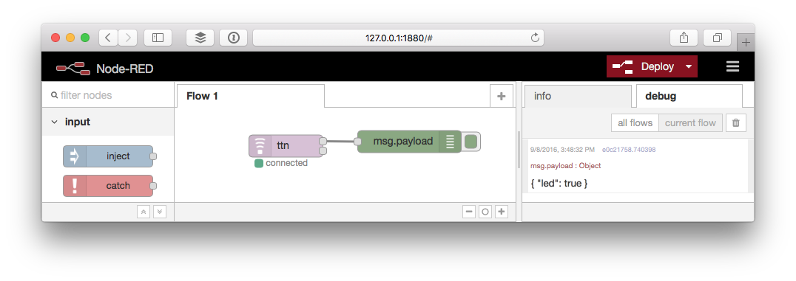

# Test
Let's verify if Node-RED receives your application messages.

## Messages
Messages sent by devices on the application can be received via the upper output of the **ttn** node.

1.  Drag a **debug** node from the output category of the toolbox.
2.  Drag the upper output of the **ttn** node to the input of the **debug** node.

    

3.  Click **Deploy**.
4.  In the right sidebar select the **debug** tab.
5.  Soon after a device activates or sends a message to your application you should see it come in like this:
    
    

    By default the debug node only shows `msg.payload`, which is mapped to `msg.payload_fields` or `msg.payload_raw` of the original message received via MQTT. If you followed the [The Things Uno Quick Start](/uno/#quick-start) this would look like:

    ```json
    { 
      "message": "Hello"
    }
    ```
    
6.  Double click the **debug** node to edit it.
7.  Click the gray part of the **Output** value, select **complete msg object** and click **Done**.
8.  For the next message you should now see it in full, e.g.:

    ```json
    {
      "app_id": "hello-world",
      "dev_id": "my-uno",
      "port": 1,
      "counter": 63,
      "payload_raw": "SGVsbG8=",
      "payload_fields": {
        "message": "Hello"
      },
      "payload": {
        "message": "Hello"
      },
      "metadata": {
        "time": "2016-09-06T13:39:51.11186125Z",
        "frequency": 868.1,
        "modulation": "LORA",
        "data_rate": "SF7BW125",
        "coding_rate": "4/5",
        "gateways": [
          {
            "eui": "B827EBFGFE87BD21",
            "timestamp": 3746387779,
            "time": "2016-09-06T13:39:51.077691Z",
            "rssi": -76,
            "snr": 7.2,
            "rf_chain": 1
          }
        ]
      }
    }
    ```

## Device activation events
Device activation events are sent from the lower node output.

Follow the same steps as for **Messages** to verify that `msg.payload` will get you just the Device ID. If you let the debugger show the full message it should look like:

```json
{
  "app_id": "hello-world",
  "app_eui": "70B3D57ED0000AFB",
  "dev_id": "my-uno",
  "dev_eui": "0004A30B001B7AD2",
  "dev_addr": "260023BB",
  "metadata": {
    "time": "2016-09-07T12:43:17.97454032Z",
    "frequency": 867.1,
    "modulation": "LORA",
    "data_rate": "SF7BW125",
    "coding_rate": "4/5",
    "gateways": [{
      "eui": "0000024B08060112",
      "timestamp": 3546311603,
      "time": "2016-09-07T12:43:17.938537Z",
      "channel": 2,
      "rssi": -107,
      "snr": 1.2
    }]
  }
}
```

