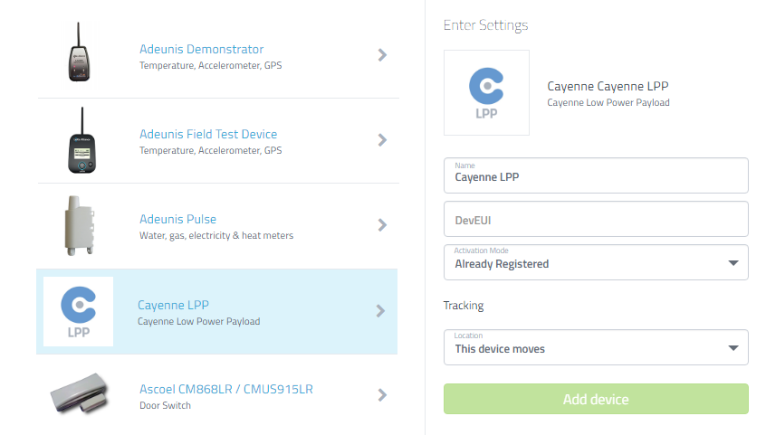
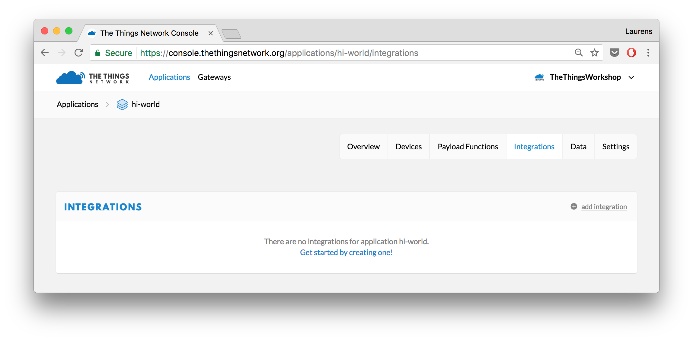

# myDevices Cayenne
<!--  -->

[myDevices Cayenne](https://mydevices.com/) allows you to quickly design, prototype, and visualize IoT solutions. You can use Cayenne as a tool to visualize real-time and historical data, sent over The Things Network.


## Change the payload to Cayenne LPP

In order to display your content in the Cayenne dashboard, the payload has to be encoded with the Cayenne Low Power Payload (LPP)

> We need to send extra data for Cayenne to understand what data comes into their dashboard. Before we send the sensor data, we need to define what type of data it is. The first byte is the so-called `Channel ID`. The second byte explains the `Data Type`. The latter bytes contain the actual sensor values.
Please have a look [**here**](https://mydevices.com/cayenne/docs/#lora-cayenne-low-power-payload) to find more information on the **Cayenne Low Power Payload (LPP)**.

### CayenneLPP Class
Documentation about altering your Arduino Sketch to encode data with `CayenneLPP` can be found [here](https://www.thethingsnetwork.org/docs/devices/arduino/api/cayennelpp.html).

*Example code:*

```js
TheThingsNetwork ttn(loraSerial, debugSerial, freqPlan);
CayenneLPP lpp(51);                    // create a buffer of 51 bytes to store the payload

lpp.reset();                           // clear the buffer
lpp.addTemperature(1, 22.5);           // on channel 1, add temperature, value 22.5°C
lpp.addBarometricPressure(2, 1073.21); // channel 2, pressure
lpp.addGPS(3, 52.37365, 4.88650, 2);   // channel 3, coordinates

ttn.sendBytes(lpp.getBuffer(), lpp.getSize());
```

### Contact your device

In order to send data to your device, you first need to "open" a channel. For that, send a packet saying that an `Output` is available, you only need to do that once. Both digital and analog are available.
```js
  lpp.addDigitalOutput(2, 1);
  //or
  lpp.addAnalogOutput(2, 120.0);
```
An action button will then appear on your dashboard; Now you can send data to your device with a click!

Be aware, the data sent by the dashboard will arrive on the same channel as the `Output` but will be tagged as `Input`.


### Set the Payload Format in the Console

After encoding data with CayenneLPP, have a look at the console to change the **Payload Formats**

* Go to your Application in [**The Things Network Console**](https://console.thethingsnetwork.org/) and click **Payload Formats**
* In the dropdown menu select **Cayenne LPP** instead of **Custom**


## Set up your myDevices account

1.  Create an account on [myDevices](https://mydevices.com/)
2.  Log-in and click on **LoRa**
	
	
3.  Select **The Things Network** at the bottom of the left menu bar, click on **Cayenne LPP** and fill in your **DevEUI** of your device (which you can find in the [**Console**](https://console.thethingsnetwork.org/applications))
	


## Add the myDevices Cayenne integration in the Console

1.  Go to your application in the [**Console**](https://console.thethingsnetwork.org/applications) and add the Cayenne integration via **Add Integration**
  

2.  You can find your **Process ID** in the URL of the myDevices Cayenne dashboard, starting after `/lora/`
3.  Add the integration


## Build your Cayenne dashboard
Click the device on the left side of your dashboard in Cayenne and your data as well as the actions buttons are shown right away. After a bit of editing you can make quite some fancy stuff.

 


🎉 Now impress some folks with this amazing dashboard you built on Twitter, using *@thethingsntwrk @CayenneIoT*

