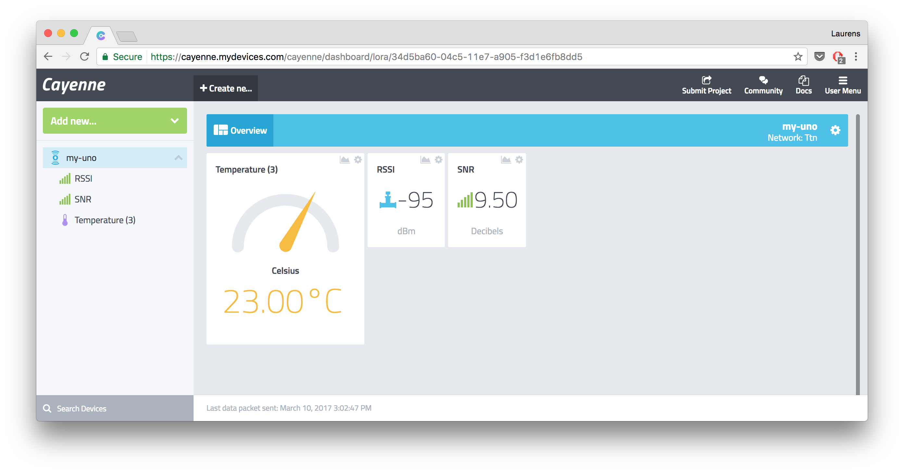

# myDevices Cayenne
<!--  -->

[myDevices Cayenne](https://mydevices.com/) allows you to quickly design, prototype, and visualize IoT solutions. You can use Cayenne as a tool to visualize real-time and historical data, sent over The Things Network.


## Change the payload to Cayenne LPP

In order to display your content in the Cayenne dashboard, the payload has to be encoded with the Cayenne Lower Power Protocol (LPP)

> We need to send extra data for Cayenne to understand what data comes into their dashboard. Before we send the sensor data, we need to define what data is sent. The first byte is the so-called `Channel ID`. The sencond bytes explains the `Data Type` (so Cayenne knows that the data contains temperature values). The latter bytes contain the actualy sensor values.
Please have a look [**here**](https://mydevices.com/cayenne/docs/#lora-cayenne-low-power-payload) to find more information on the **Cayenne Lower Power Protocol (LPP)**.
 

###CayenneLPP Class
Documentation about altering your Arduino Sketch to encode data with `CayenneLPP` can be found [here](https://www.thethingsnetwork.org/docs/devices/arduino/api/cayennelpp.html).

Examle code: 

```js
TheThingsNetwork ttn(loraSerial, debugSerial, freqPlan);
CayenneLPP lpp(51);

lpp.reset();
lpp.addTemperature(1, 22.5);
lpp.addBarometricPressure(2, 1073.21);
lpp.addGPS(3, 52.37365, 4.88650, 2);

ttn.sendBytes(lpp.getBuffer(), lpp.getSize());
```

### Set the `Payload Format` in the Console

After encoding data with CayenneLPP, have a look at the console to change the **Payload Formats**

* Go to your Application in the [**The Things Network Console**](https://console.thethingsnetwork.org/) and click **Payload Formats**
* Select in the dropdown menu **Cayenne LPP** instead of **Custom**


## Setup your myDevices account

1.  Create an account on [myDevices](https://mydevices.com/)
2.  Log-in and click on **LoRa**
	
	
3.  Select **The Things Network** at the bottom of the left menu bar, click on **Cayenne LPP** and fill in your **DevEUI** of your device (which you can find in the [**Console**](https://console.thethingsnetwork.org/applications))
	


## Add the myDevices Cayenne integration in the Console

1.  Go to your application in the [**Console**](https://console.thethingsnetwork.org/applications) and add the Cayenne integration via **Add Integration**
	 

2.  You can find your **Process ID** in the URL of the myDevices Cayenne dashboard, starting after `/lora/`
3.  Add the integration


## Build your Cayenne dashboard
Click the device on the left side of your dashboard in Cayenne and your data is shown right away. After a bit of editing you can make quite some fancy stuff.

 


🎉 Now impress some folks with this amazing dashboard you built on Twitter, using *@thethingsntwrk @CayenneIoT*

