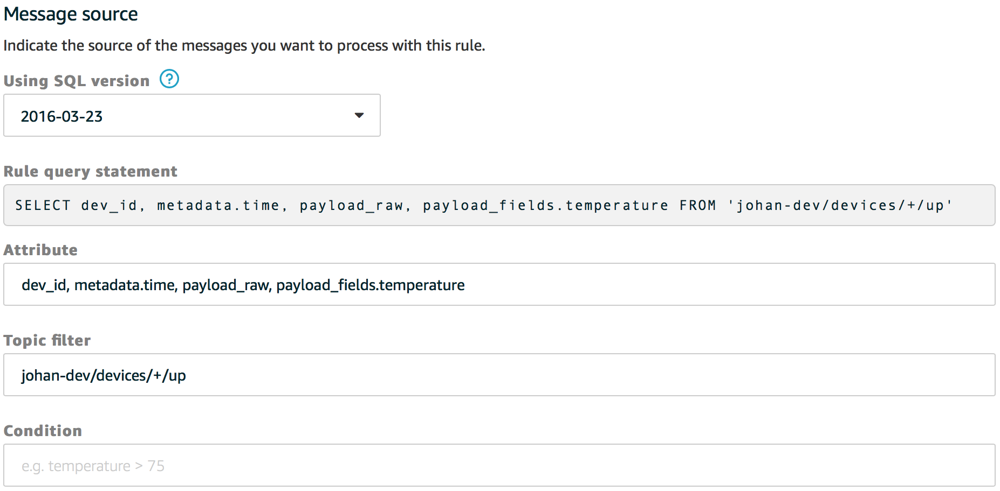
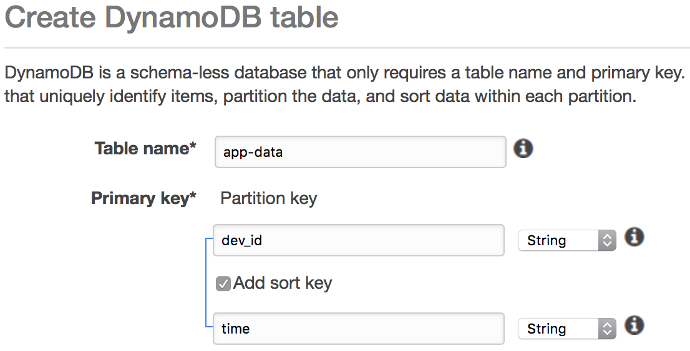
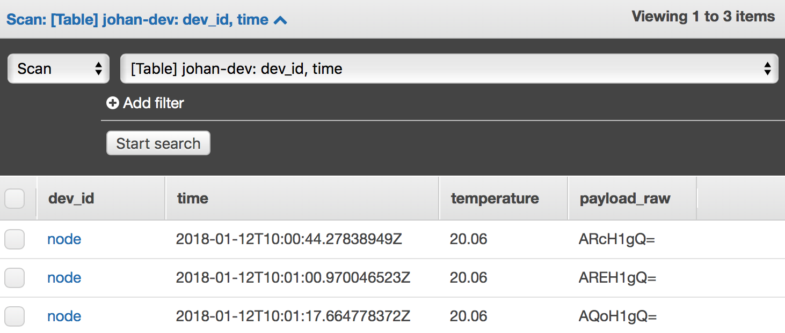

# Act on Data

AWS IoT rules allow for filtering and routing uplink messages to many AWS services, including storing S3 files, sending push notifications through SNS, sending to SQS queues, invoking Lambda functions and many more. [See Rules for AWS IoT](https://docs.aws.amazon.com/iot/latest/developerguide/iot-rules.html) for more information.

This guide walks you through storing uplink messages in AWS DynamoDB.

## Store Data in DynamoDB

A common reason to use IoT platforms such as AWS IoT is to store uplink messages to analyze later. AWS comes with the highly scalable table-based storage service DynamoDB. This guide walks you through storing uplink messages to a AWS DynamoDB table.

1. Log in to the [AWS Management Console](http://console.aws.amazon.com)
2. In **Services** under **Internet Of Things**, go to **AWS IoT**
3. In the menu on the left, go to **Act**
4. Click **Create rule**
5. Enter a name for the rule, e.g. `store`
6. Under **Message source**, you can query JSON messages that are published on MQTT in a SQL-like format

   * In **Attribute**, enter `dev_id, metadata.time, payload_raw` to query the device ID, the time and the raw payload. You can add payload fields too, for example `payload_field.temperature`
   * In **Topic filter**, enter `+/devices/+/up` (see [messages](./test-messages.md#uplink-messages))
   * Optionally, in **Condition**, enter a filter. Leave blank to store everything

   

7. Click **Add action**
8. Select **Split messages into multiple columns of a database table (DynamoDBv2)**
9. Under **Table name**, click **Create a new resource**. A new browser tab opens

   1. Click **Create table**
   2. Enter any **Table name**, for example `my-app`
   3. As **Partition key**, enter `time`
   4. Optionally, check **Add sort key** and enter **dev_id** to sort by device ID

      

   5. Click **Create** and leave this tab open

10. Go back to the AWS IoT tab, and click refresh next to **Table name**
11. Select your newly created table
12. Click **Create new role** and enter `aws-iot-dynamodb`, or update an existing role to grant access from AWS IoT to the DynamoDB table
13. Click **Add action**
14. Click **Create rule**
15. Go back to the DynamoDB table tab, and go to **Items**
16. Click refresh to view your stored data:

    
