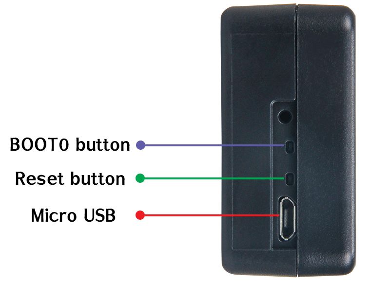
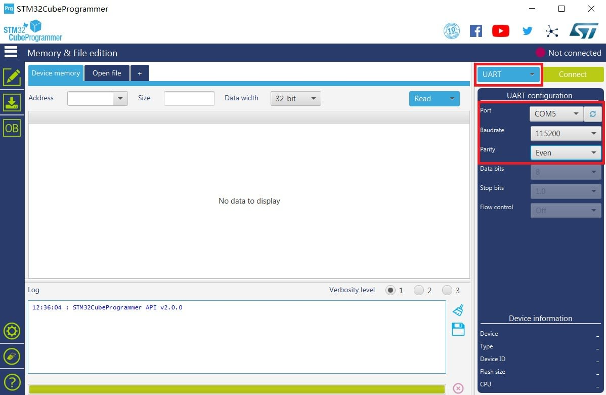
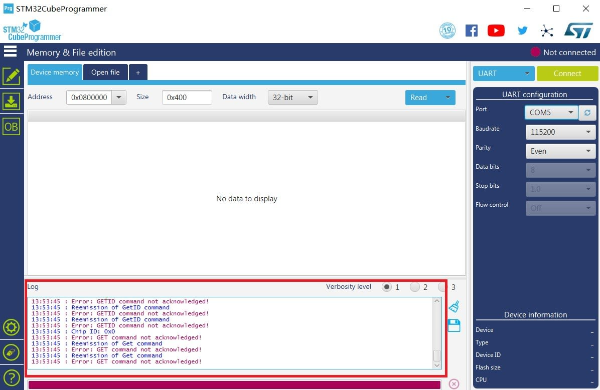
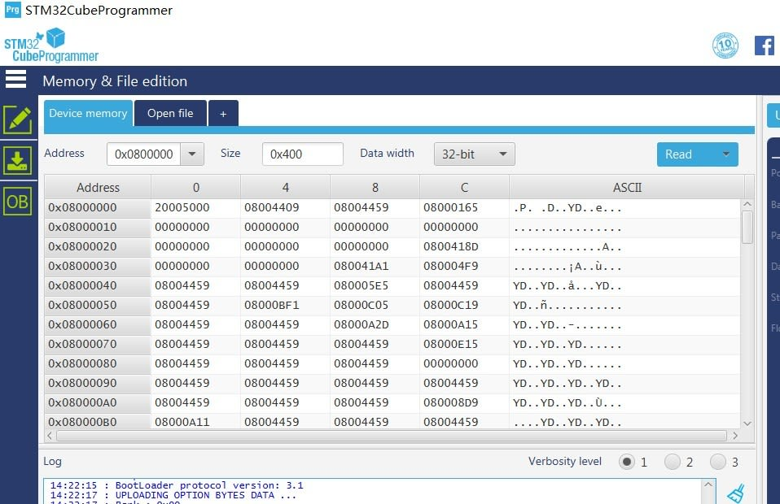
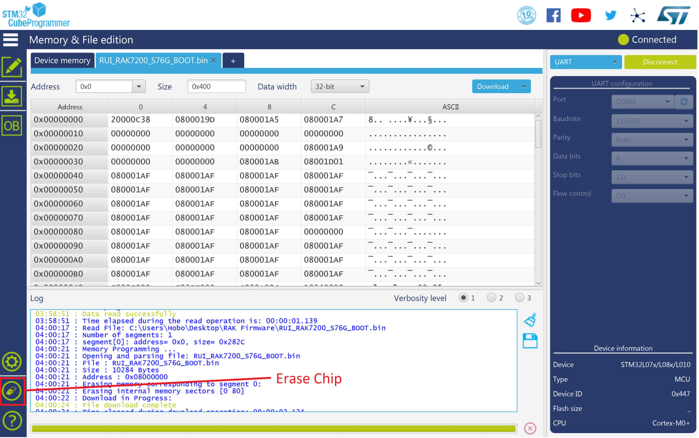
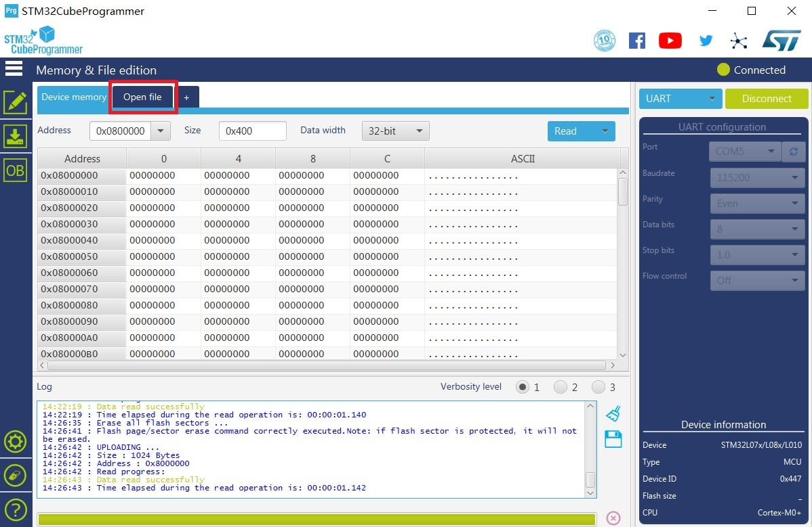
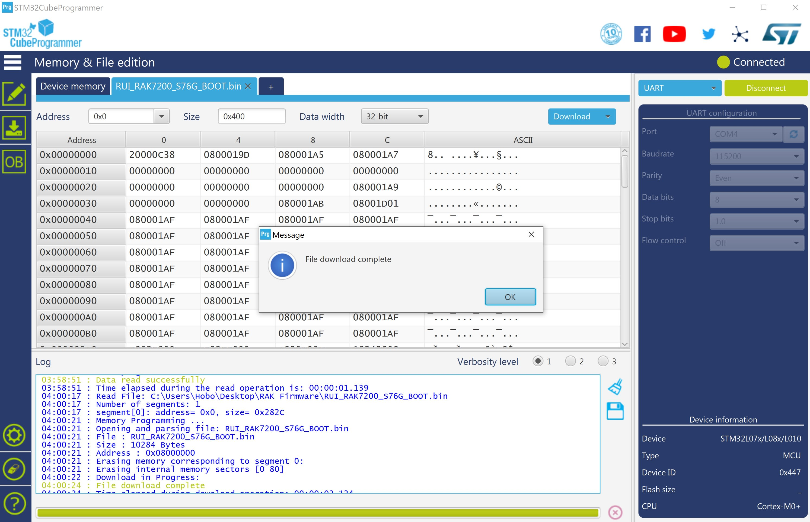

# Device Firmware Setup

**1**.Download the latest bootloader [here](https://downloads.rakwireless.com/en/LoRa/RAK7200-Tracker/Firmware/) in order to avoid potential problems.
**2**.To start with the bootloader burning, download and install the **STM32CubeProgrammer** tool [here](https://www.st.com/content/st_com/en/products/development-tools/software-development-tools/stm32-software-development-tools/stm32-programmers/stm32cubeprog.html#overview)
**3**.Plug in the provided Micro-USB cable into the RAK7200 LoRa® Tracker and insert it in your PC. We need to set the RAK7200 first to work in **Boot Mode**. Refer to the image below and do the following: Hold down the BOOT0 Button, then press the Reset Button for a couple of seconds. Release the Reset and the BOOT0 Button.

 
**4**.Open the STM32CubeProgrammer Software and Select UART type. Choose the appropriate port number in the COM Port field. You can also check this [document](https://doc.rakwireless.com/rak7200-lora---tracker/interfacing-with-rak7200-lora---tracker
) on how to properly interface your RAK7200 LoRa® Tracker with your Computer. Set the **Baud Rate** to **115200**, **Parity** to **Even** and the press **Connect** as shown in the image below:

>**Note:** If you didn't properly set your RAK7200 LoRa® Tracker to work in BOOT Mode, you will see the following information in the Log Section of the Software as shown in the image below.

* If this happens, go back to the section above and set your RAK7200 LoRa® Tracker to work in Boot Mode again.
* If all works well, you will then see the following log:

**5**.Before going through the bootloader burning process, click the "**Erase Chip**" button to erase all the data on RAK7200 LoRa® Tracker as shown in the image below.

**6**.Afterwhich, click "**Open File**" and select the correct Bootloader file that you have just downloaded.

**7**.Click the "**Download**" Button to start the burning process:

**8**.After a couple of seconds, you will see the following window telling that you have successfully burned the Bootloader to your RAK7200!

**9**.“**Disconnect**” and close the “**STM32CubeProgrammer**” tool.