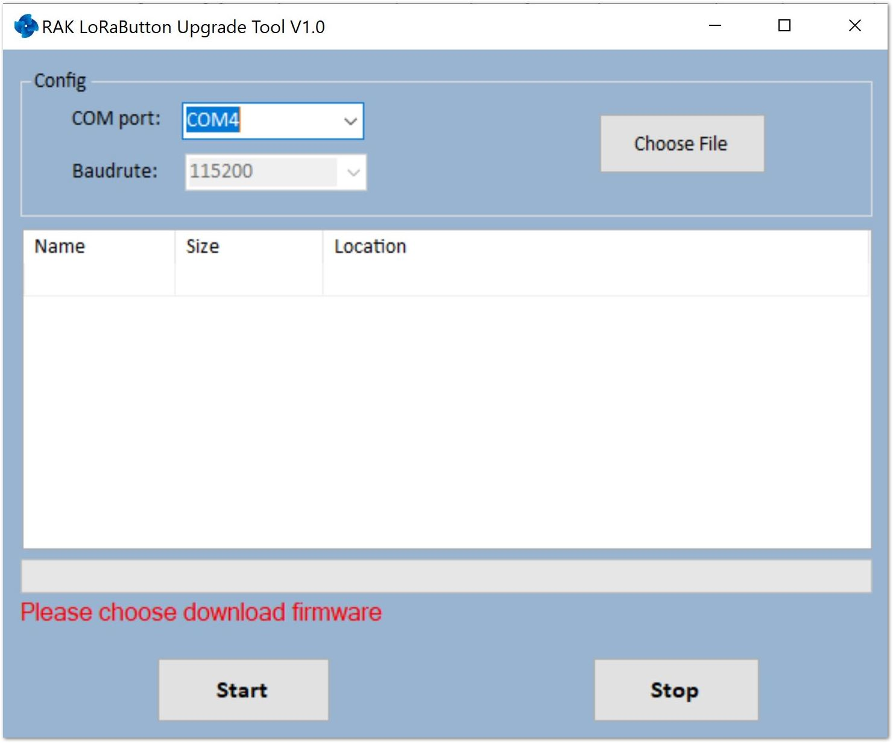
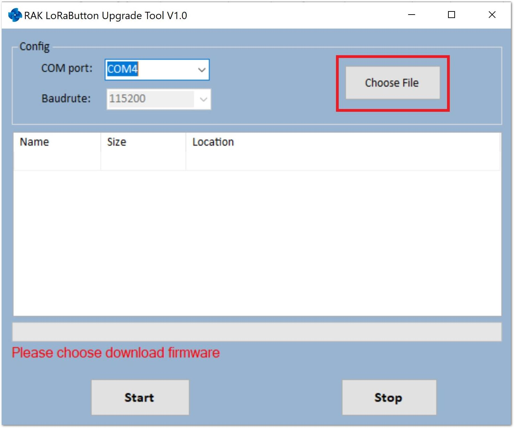
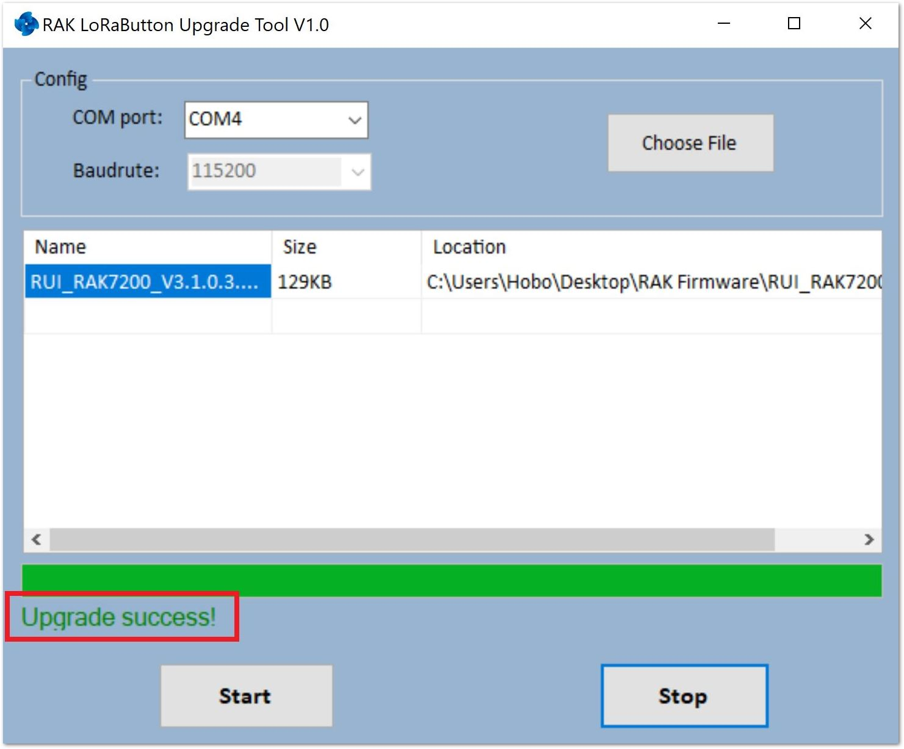
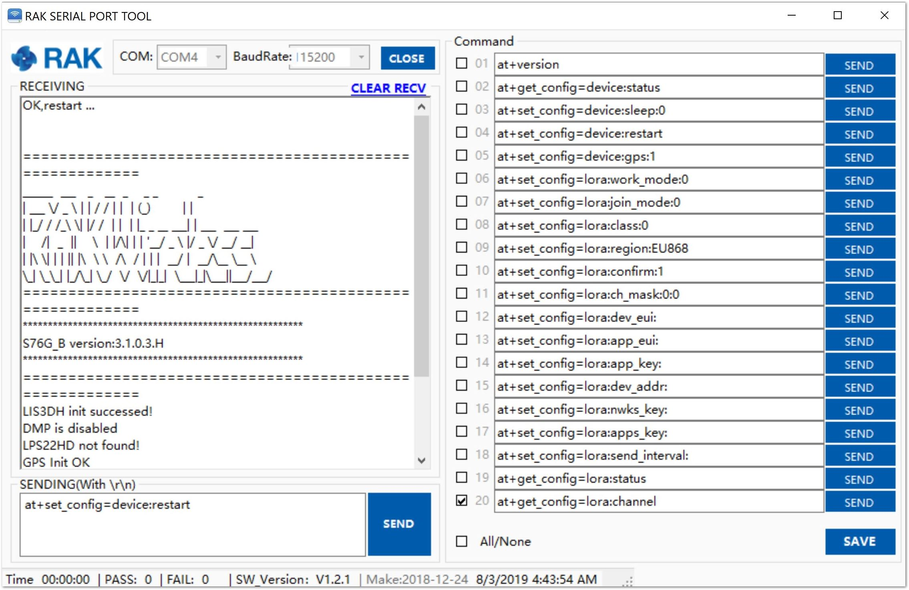

# Device Firmware Upgrading

If the firmware version of your RAK7200 LoRa Tracker is newer than V3.0.0.0 or you have just burned the bootloader into the board according to the Burning the Bootloader section, proceed to Step 2.

**1**- In case you have not just burned the bootloader, as instructed in the previous section you need to manually go into boot mode. Open and download the RAK Serial Port Tool Here .Connect your board via the USB interface and enter the following AT command:
```
at+set_config=device:boot
```


**2**- Download the RAK Upgrade Tool from the RAKwireless website [**here**](https://downloads.rakwireless.com/en/LoRa/RAK612-LoRaButton/Tools/RAK%20LoRaButton%20Upgrade%20Tool%20V1.0.zip) then, open the tool. Again, don't forget to choose the correct port!



**3**- Download the latest RAK7200 Firmware [**here**](https://downloads.rakwireless.com/en/LoRa/RAK7200-Tracker/Firmware/). Click “**Choose File**” and choose the firmware you have just downloaded. Make sure you choose the one for your particular band:



**4**- Click **“Start”** to upload the Firmware and wait for a confirmation as shown in the image below. Uploading may take minutes.



## Testing the Installed Firmware

**1**- In order for you to check if you have successfully installed the firmware on your RAK7200 LoRa Tracker, open the Serial Port tool again. Press the "**Reset Button**" or type the command below. If everything works perfectly, you should see the following message below:
```
at+set_config=device:restart
```


This information means that you have uploaded the Firmware successfully!