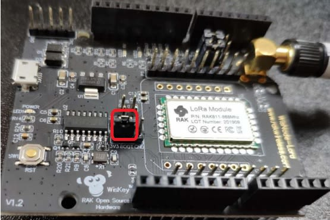
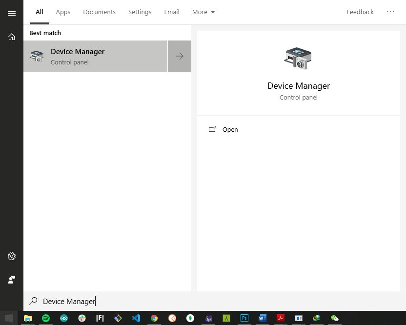
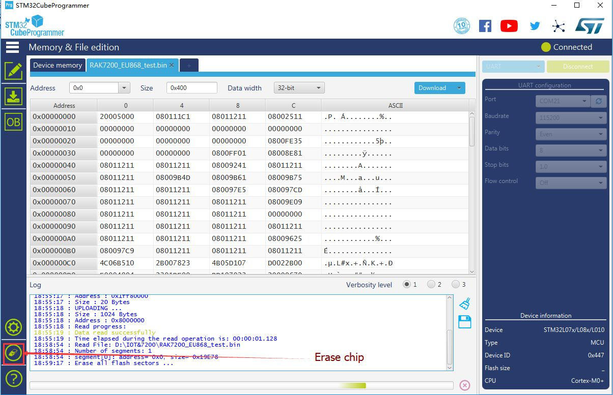
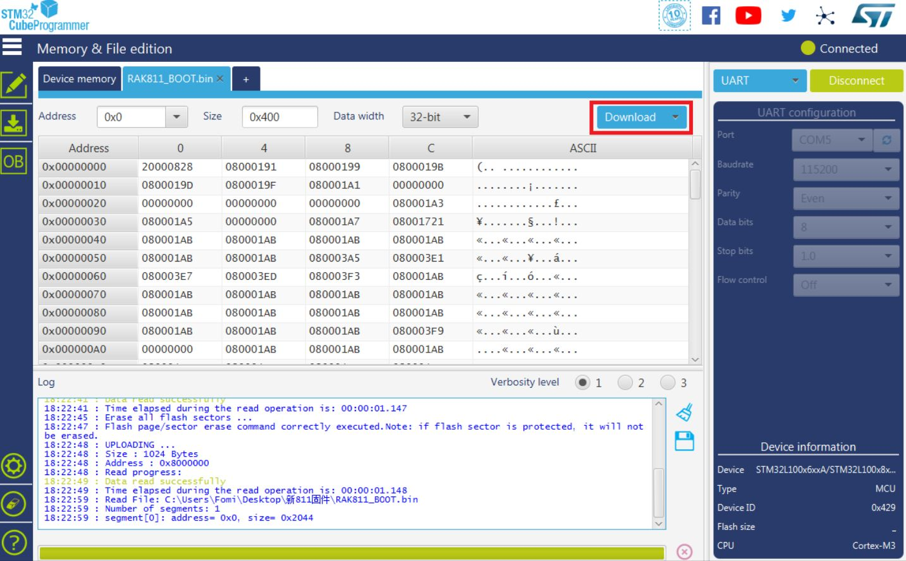
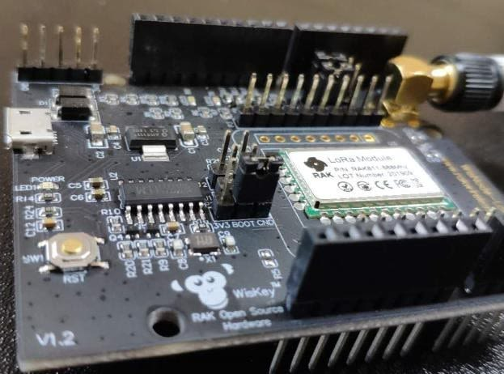
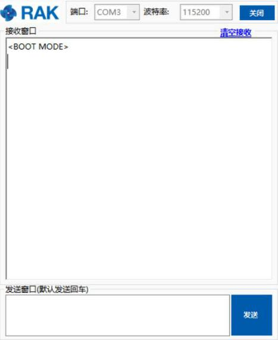

# Device Firmware Setup

>**Note:** Skip this section if you have a V3.0.0.0 RAK811 Firmware or newer, for it has a bootloader preloaded already. 

## Burn the latest firmware
**1**.Download the latest firmware [here](https://downloads.rakwireless.com/en/LoRa/WisNode/Firmware/) in order to avoid potential problems.

**2**.To start with the firmware burning, download and install the **STM32CubeProgrammer** tool [here](https://www.st.com/content/st_com/en/products/development-tools/software-development-tools/stm32-software-development-tools/stm32-programmers/stm32cubeprog.html#overview)

**3**.Bridge the “**BOOT**” pin and “**3V3**” pin to set the board in boot mode as shown in the image below:

 
**4**.Choose the correct port number in the COM Port field. You can check this in the Device Manager. You can also check this [document](https://doc.rakwireless.com/rak811-lora---evaluation-board/interfacing-with-rak811-lora---evaluation-board) on how to properly interface your RAK811 LoRa® Evaluation Board with your Computer.

**4**.Open the “**STM32CubeProgrammer**” tool.

**5**.Select UART type; go to COM Port and look for your RAK811 LoRa® Evaluation Board COM Port (ex. COM5).

**6**.Configure the Baud Rate and Parity.

**7**.Then, press the “**Connect**” button at the top right corner.
>**Note:** If there are some errors in the Log box or it can't connect, just close SMT32Cubeprogrammer, and reinsert the RAK811 LoRa® Evaluation Board again and reopen the SMT32Cubeprogrammer and connect.

Now, let’s start burning the bootloader into the RAK811 LoRa® Evaluation Board.

**8**.First, **ERASE** all data on the RAK811 LoRa® Evaluation Board referred from the following picture below:

**9**.Press “**Open file**” and select the bootloader file in the pop-up window.
**10**.Click the “**Download**” button to start the burning process.

**11**.OK, you have burned the firmware into RAK811 LoRa® Evaluation Board successfully!

**12**."**Disconnect**” and close the “STM32CubeProgrammer” tool. Remove the jump in the "**BOOT**" and "**3V3**" pins and transfer it to the “**BOOT**” pin and the “**GND**” as shown in the image below:.

**13**.Pull out and reinsert the USB interface into your PC.
If you have opened the serial port tool, you can see some content like this:

Alright! You can now start burning the upgraded firmware into the RAK811 LoRa® Evaluation Board.
