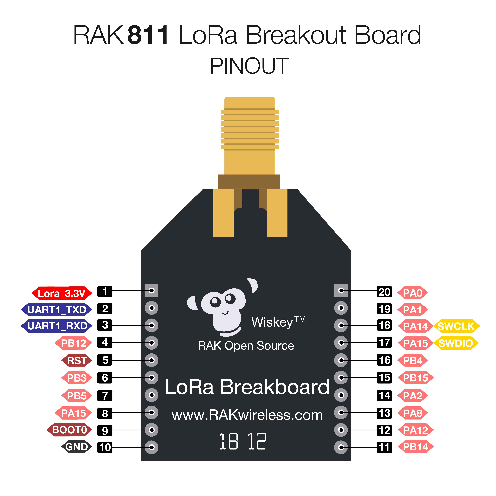
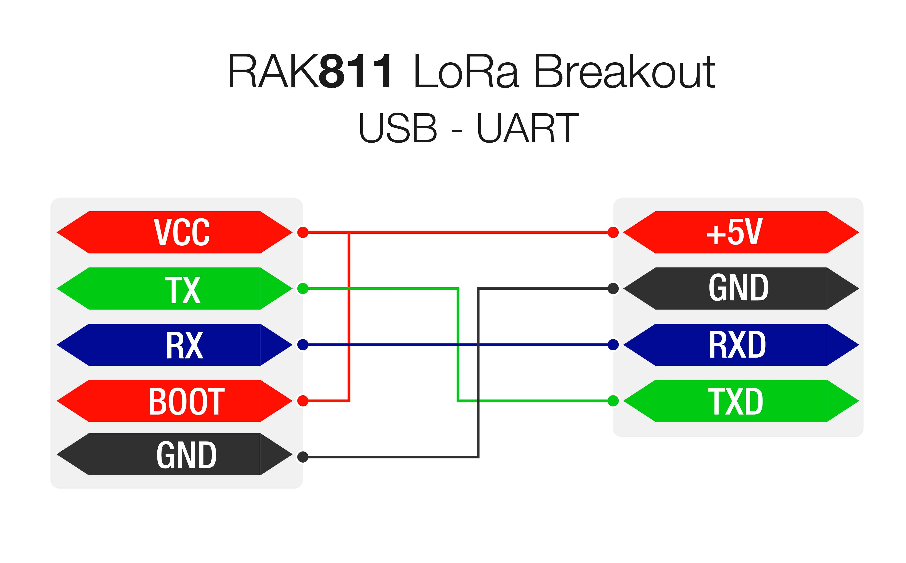

# Device Firmware Setup

>**Note:** Skip this section if you have a V3.0.0.0 RAK811 Firmware or newer, for it has a bootloader preloaded already. 

## Burn the latest firmware
* Download the latest firmware [here](https://downloads.rakwireless.com/en/LoRa/RAK811/Firmware/) in order to avoid potential problems.
* To start with the firmware burning, download and install the **STM32CubeProgrammer** tool [here](https://www.st.com/content/st_com/en/products/development-tools/software-development-tools/stm32-software-development-tools/stm32-programmers/stm32cubeprog.html#overview)
* Then, configure your RAK811 by jumping the “**BOOT**” pin and “**VCC**” pin for boot mode then connect **RX, TX, VCC,** and **GND** with a USB-UART tool, as the following pictures shown below:

 

* Choose the correct port number in the COM Port field. You can check this in the Device Manager. 

* Open the “**STM32CubeProgrammer**” tool.

*  Select UART type; go to COM Port and look for your RAK811 WisDuo LoRa Module COM Port (ex. COM5).

*  Configure the Baud Rate and Parity.

* Then, press the “**Connect**” button at the top right corner.
>**Note:** If there are some errors in the Log box or it can't connect, just close SMT32Cubeprogrammer, and reinsert the RAK811 WisDuo LoRa Module again and reopen the SMT32Cubeprogrammer and connect.

Now, let’s start burning the bootloader into the RAK811 WisDuo LoRa Module.

* First, **ERASE** all data on the RAK811 WisDuo LoRa Module referred from the following picture below:

* Press “**Open file**” and select the bootloader file in the pop-up window.
* Click the “**Download**” button to start the burning process.

* OK, you have burned the firmware into RAK811 WisDuo LoRa Module successfully!

* "**Disconnect**” and close the “STM32CubeProgrammer” tool. Then, disconnect BOOT pin and VCC pin to let RAK811 WisDuo LoRa Module work in normal mode.
* Pull out and reinsert the USB interface into your PC.
If you have opened the serial port tool, you can see some content like this:

Alright! You can now start burning the upgraded firmware into the RAK811 WisDuo LoRa Module.
