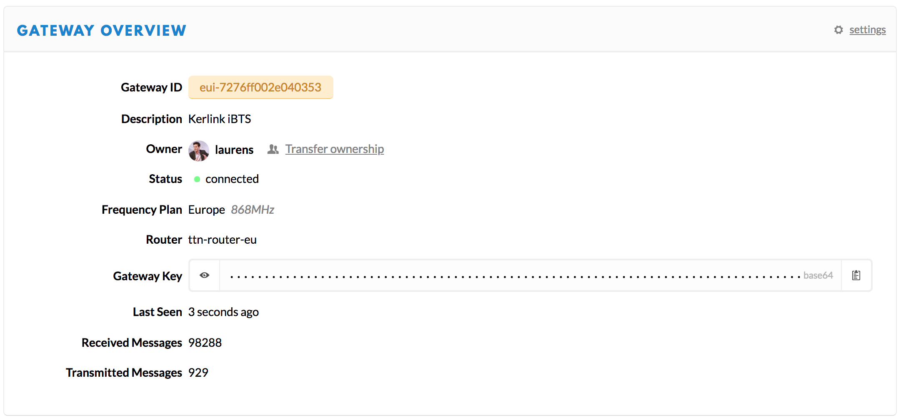

# iBTS

The Wirnet iBTS is the successor of the Wirnet IoT Station. It is based on Semtech's gateway reference design and can be used for GPS-free geolocalization services.

The Wirnet iBTS has a modular architecture allowing you to configure and upgrade the gateway to according to your needs. Thanks to the modularity you are able to choose:

* The backhaul network: Ethernet or GPRS/EDGE/HSPA/CDMA/LTE
* The unlicensed band (ISM) where to operate the LoRa LPWAN: 868MHz, 902-928MHz or 915-928MHz
* The number of channels to operate the LoRa LPWAN: 8 to 64
* The antenna interface: single (omnidirectional), dual (space diversity or dual polarization) or tri (sectorization) 


[Source & further info](http://wikikerlink.fr/wirnet-ibts/doku.php)
*You do need to request a login and password from Kerlink*


## 1. Connecting to the gateway

You can either connect to the gateways via SSH, or via the Wirma2 Debug Tool. [More info](http://wikikerlink.fr/wirnet-ibts/doku.php?id=wiki:connect)

Once you are connected to the gateway, log in with `root` / `pdmk-$serialno` as credentials. The `$serialno` equals the 6 last characters of its serial number. 

> For security reasons, it is highly recommended to change the password. You can do so with the command: `passwd`

### Connect via SSH 

* ##### Remote LAN connection

  * **Using SSH:** Start an SSH client (typically Putty on Windows) using port 22 and the gateway’s IP address obtained from the DHCP server.

 * **Using SFTP:** Start a SFTP client (typically WinSCP on Windows) using the gateway’s IP address obtained from the DHCP server.


* ##### Local connection

 You can connect you laptop directly to the gateway via the LOCAL port. 

  * If you have an DHCP server: Start an ssh client on port 22 and use the gateway’s IP address obtained from the DHCP server. 

  * You don't have a DHCP server: Configure your PC Ethernet card to use `192.168.1.100` (netmask: 255.255.255.0) and start a ssh client on port 22 and using the gateway default LOCAL IP address which is `192.168.1.1`.


## 2. Update the firmware

Check the firmware version using the command:

```
cat /tmp/sys_startup_status.json

```

It should respond something like:

```
{
    "cpu": {
        ...
        }, 
        "serial_number": "0x2e040353", 
        "start_time": "15:19:04 2018-07-09", 
        "sw_version": "3.1.7_20170516105845"
```


#### Update with the last firmware version:

To update the gateway firmware with the last **Wirnet iBTS KerOS** firmware, go to Kerlink's [Resources page](http://wikikerlink.fr/wirnet-ibts/doku.php?id=wiki:resources#ibts_keros_firmware). The firmware can be updated via a USB key or over the Network.

> You can also use the file **Liveburner IPK** for updating this Kerlink firmware, this will however erase the whole partition and resets the default password. 

**Option 1: Software update over USB**

1. Find an empty USB key (FAT-32 formatted) and add the 3 files:

 * `usb.autorun`
 * `usbkey.txt`
 * `keros_x.y.z.ipk`

2. Plug the USB key in the gateway, the firmware is automatically installed. Unplug the USB key when the yellow debug led starts blinking fast.

3. Reboot the gateway.

4. Check if the firmware is properly updated via the command `/tmp/sys_startup_status.json`, you can see the version after the line `sw_version`.


**Option 2: Software update over Network**

*This example uses a package meant to upgrade the firmware, however the steps are the same for any other package.*

1. Create the directory `.updates` under `/user`:
 
 ```
 mkdir -p /user/.updates
 ```

2. Transfer the KerOS package corresponding to the new firmware in this directory

 ```
 scp keros_2.0.4.ipk root@<ip_address>:/user/.updates/
 ```

3. Ensure file is correctly written:
 
 ```
 sync 
 ```

4. Trigger Update for next reboot:
 
 ```
 kerosd -u 
 ```

5. Restart:

 ```
 reboot
 ```

6. Check the firmware version in the file `/tmp/sys_startup_status.json` under the field `sw_version`.


### 3. FPGA update

To use the latest packet forwarder release, it is required to update the FPGA with the latest FPGA release available in [resources](http://wikikerlink.fr/wirnet-ibts/doku.php?id=wiki:resources#fpga_updater) if not yet installed.

To check the current FPGA version, run the command:

```
cat /tmp/sys_startup_status.json | grep fpga_swver
```

For the update you can again choose to install the latest version via the network or via USB. (If you install the file via USB, make sure to add the files `usb.autorun` and `usbkey.txt` to the USB key.)
 
### 4. Connect to The Things Network

1. Install Semtech's latest packet forwarder which can be found under Kerlink's [Resources section](http://wikikerlink.fr/wirnet-ibts/doku.php?id=wiki:resources#semtech_packet_forwarder_v2). Download the pre-compiled `.ipk` version which looks something like this: `spf2_5.1.0-klk4_5.1.0-klk5_klk_lpbs.ipk`

 Install the packet forwarder over the network or USB and reboot the gateway.

2. Open the file `/user/spf2/etc/config.json` to fill in the settings to connect it to the right LoRaWAN Network Server. At the bottom of the file you can set the `gateway_conf` settings. The settings should eventually look something like: 

 ```
 "gateway_conf": {         
        "gateway_ID": "7276FF00XXXXXXXX",
        "server_address": "router.eu.thethings.network",
        "serv_port_up": 1700,                                                                                                                                 
        "serv_port_down": 1700,
        ...
 ```   

 * Add a line with the `gateway_ID`. The ID always starts with: `7276FF00` and end with the 8 last characters of its serial number. 
 > Write down the gateway_ID, you'll need it later for registering the gateway in the Developer Console.

 * Check [this link](https://www.thethingsnetwork.org/docs/gateways/packet-forwarder/semtech-udp.html#router-addresses) for the right `server_address`. 

 * The UDP ports `1700` are used, both for outgoing and incoming traffic. You can set this UDP port in the lines `serv_port_up` and `serv_port_down`. (In some cases, firewalls block these UDP ports. Please contact your network administrator if you’re in doubt).

 * Reboot the gateway after setting the **gateway_conf**.

     
3. Register the gateway in the [Developer Console](https://console.thethingsnetwork.org/). You can find more information on how to register your gateway in the Console [here](https://www.thethingsnetwork.org/docs/gateways/registration.html). If all went well, you should see something like this:

 

