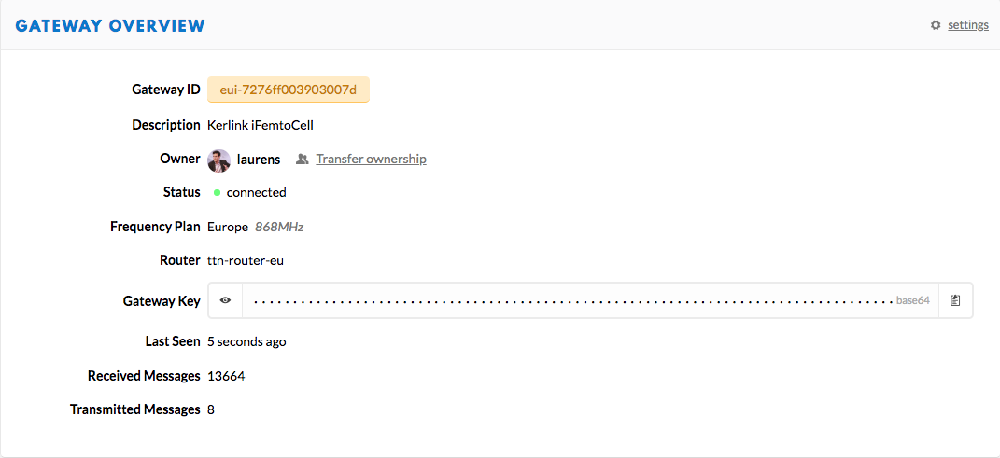

# Kerlink iFemtoCell

The wirnet iFemtoCell is a low-cost, indoor LoRaWAN nano gateway that can be easily connected through WiFi or ethernet.


[Source & further info](http://wikikerlink.fr/wirnet-ifemtocell/doku.php?id=wirnet-ifemtocell)
*You do need to request a login and password from Kerlink*


## Powering the iFemtoCell

Connect the 12V adapter.


## Connecting to the iFemtoCell

iFemtoCells are named after their serial number and are called `klk-wifc-XXXXXX`. You can replace the `XXXXXX` by the six hexadecimal digits from the serial number which are also the last six hexadecimal digits of the **Board ID** (printed on the bottom of the gateway).

> For example, if an iFemtoCell has `704BEc1234AB` as board ID, the host name will be: `klk-wifc-1234AB`

### Ethernet or WiFi
 
Both ethernet and WiFi can be used (for WiFi, make sure to use the firmware 3.3.3. or later). A WiFi access point is available at boot time on each iFemtoCell for one hour, broadcasting an SSID named after its serial number (`klk-wifc-XXXXXX`). It can only be used to access the iFemtoCell itself as it does not route traffic to anywhere and does not serve as an Internet wireless access point.

The passphrase to connect to this WiFi network is the Ethernet MAC address (it can be found on the Wirnet iFemtoCell label), in uppercase, without spaces between the digits, e.g. `7076FFYYYYYY`.

> Note that this interface does not come with a DHCP server, it is only meant to be used for the iFemtoCell's configuration. Your computer may take some time to get the “connected” status, and the interface will have a “limited connectivity”, which is normal.


### iFemtoCell login/password

To prevent Web robots from attacking the gateway with standard login/password “root/root”, default password is built using the last 6 characters of the board ID: `pdmk-XXXXXX`. 

For example, if an iFemtoCell has `704BEc1234AB` as board ID, then the root password will be `pdmk-1234AB` (case sensitive).

klk-wifc_1234AB login: `root`
Password: `pdmk-1234AB`

> For security reasons, it is highly recommended to change the password. You can do so with the command: `passwd`


## Install latest firmware (optional)

To install the latest firmware (watch out: this erases the whole partition to reinstalls the firmware):

1. Find an empty usb stick (FAT-32 formatted)
2. Add the three files listed below to the usb. You can download the files [here](http://wikikerlink.fr/wirnet-ifemtocell/doku.php?id=wirnet-ifemtocell:resources)

 * `liveburner_X.X.X_klk-wifc-signed.ipk`
 * `usb.autorun`
 * `usbkey.txt`
 
3. Connect the usb to the gateway, the files are automatically installed. The installations is finished when the LEDs start blinking red/green


## Connect to The Things Network

Next is installing Semtech's Packet forwarder and connecting it to The Things Network.

1. Find an empty usb stick (FAT-32 formatted)
2. Add the three files listed below to the usb. You can download the files [here](http://wikikerlink.fr/wirnet-ifemtocell/doku.php?id=wirnet-ifemtocell:resources)

 * `spf_3.1.0-klk18_4.1.3-klk11_klk_wifc.ipk`
 * `usb.autorun`
 * `usbkey.txt`
 
3. Connect the usb to the gateway, the files are automatically installed. The installation is finished when the LEDs start blinking red/green
4. Open the file: `/user/spf/etc/global_conf.json`
 Fill in the details below. Check [this link](https://www.thethingsnetwork.org/docs/gateways/packet-forwarder/semtech-udp.html#router-addresses) for the right **server_address**
 ```
"gateway_conf": {
	"server_address": "router.eu.thethings.network",
	"serv_port_up": 1700,                                               
	"serv_port_down": 1700,
 ```
5. Register the gateway in the [Developer Console](https://console.thethingsnetwork.org/). You can find the gateway EUI in the file `/user/spf/etc/local_conf.json`


If all went well, you should see something like this:

