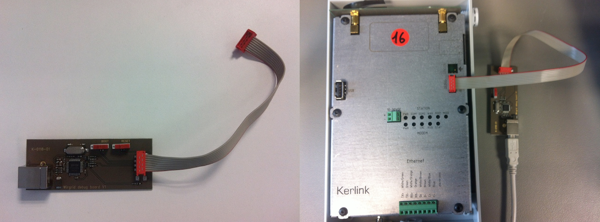

# Configuration

## Configuring packet forwarder

To configure the gateway, you need to download either [The Things Network's packet forwarder (EU version)](https://github.com/TheThingsNetwork/kerlink-station-firmware/blob/master/dota/dota_thethingsnetwork_v1.3_EU.tar.gz) and [produsb.zip](https://github.com/TheThingsNetwork/kerlink-station-firmware/blob/master/dota/produsb.zip) from our Github.

> You can find [at this link](https://github.com/TheThingsNetwork/kerlink-station-firmware/blob/master/dota/dota_thethingsnetwork_v1.4_EU.tar.gz) a debug version of the packet forwarder. With this debug version, the packet forwarder saves its logs on disk. You can access then access them by connecting to the Kerlink over serial or SSH, and by executing `tail -f /mnt/fsuser-1/thethingsnetwork/poly_pkt_fwd.log`.
> 
> If you encounter unexpected behaviours, you can use the debug version to troubleshoot problems. However, we don't recommend using it for extended periods of time or production settings. Indeed, since there is no log rotation mechanism, it can fill up the disk memory of the gateway.

Follow this procedure to update or replace the packet forwarder:

- Copy `produsb.sh` (from extracting `produsb.zip`) and the `dota_thethingsnetwork_<version>_EU.tar.gz` onto an empty USB flash drive formatted in FAT-32. Make sure there is no `.log` file.
- Plug the USB flash drive into the gateway.
- Wait for 5 min. During this time the gateway will reboot itself.
- Unplug the key and check that a `.log` file has appeared. The file should contain  `WirmaV2 0x080XXXXX updated`. This log file prevents any further installation on the gateways to avoid cyclic reboots.
- To redo the update on same gateway, remove this log file from the flash drive reinsert it into the gateway USB. This is not needed if you update another gateway.

## Connect with the Gateway

### SSH-Serial

Logon to the gateway by using the SSH protocol, on a Mac or Linux system just use the Terminal and run `ssh root@10.1.0.117` (substitute by the correct IP-address). On a Windows PC you can use [Putty](http://www.chiark.greenend.org.uk/~sgtatham/putty/download.html). Login with the user `root` and default password `root` (if using 2.x firmware) or `pdmk-0` followed by the last 7 characters of the gateway serial number (if using 3.x firmware).

Your are basically done now. For further checking continue to the next step. The following steps require some knowledge about how to use the command-line in Linux or Mac.


### WIRGRID

The serial interface (linux console) of the gateway can also be accessed by using the WIRGRID debug tool. This tool connects to your PC by a USB (type B > A) cable.



1. Connect the WIRGRID tool to your gateway and PC
2. Look up to which port the WIRGRID is assigned to
3. Open a serial connection with the following settings:
    - **Baudrate:** 115200
    - **Data length:** 8
    - **Parity:** none
    - **Stop bit:** 1
    - **Flow control:** none
4. When the connection opens up, log in with the following credentials
    - **Login:** `root`
    - **Password:** `root` (if using 2.x firmware) or `pdmk-0` followed by the last 7 characters of the gateway serial number (if using 3.x firmware)

On Linux you can connect to the debug console with the command `screen /dev/tty.usbXXXX 115200` (where XXXX is the actual port).

### Gateway username and password

Username: `root`  
Password: `root`

For 3.1 firmware, the password is `pdmk-0` followed by the last 7 characters of the serial

Example:
```
Wirnet_0b0e032d login: root
Password: pdmk-0b0e032d
```

> **Change root password**
> It is highly recommanded to change the default root password. Use the following command to change the password:
> `passwd`

## Check if the Packet forwarder is running

### On the gateway

Use the following command on the gateway to check whether data is being sent and received:

```bash
tcpdump -AUq port 1700
```

The output must be somewhat similar to the following, check out if inbound as well as outbound traffic is shown:

```
listening on eth0, link-type EN10MB (Ethernet), capture size 65535 bytes
10:40:51.571795 IP 10.10.1.84.59170 > 52.169.76.203.1700: UDP, length 202
E.....@.@...

.T4.L..“....*=.a.....K....{“rxpk”:[{“tmst”:214104396,“chan”:7,“rfch”:0,“freq”:867.900000,“stat”:1,“modu”:“LORA”,“datr”:“SF7BW125",“codr”:“4/5",“lsnr”:10.0,“rssi”:-67,“size”:19,“data”:“QJYnASYAMR4BWQCbBgrDXzkRoQ==“}]}
10:40:51.592416 IP 52.169.76.203.1700 > 10.10.1.84.59170: UDP, length 4
E.. ..@.4...4.L.

.T...“.....a................@R.Y
10:40:52.646562 IP 10.10.1.84.55114 > 52.169.76.203.1700: UDP, length 12
E..(..@.@...

.T4.L..J....9%..@....K....
10:40:52.666952 IP 52.169.76.203.1700 > 10.10.1.84.55114: UDP, length 4
E.. .k@.4...4.L.

.T...J..S...@................:lX
10:41:02.011529 IP 10.10.1.84.59170 > 52.169.76.203.1700: UDP, length 113
E....“@.@..k

.T4.L..“...y.c.......K....{“stat”:{“time”:“2017-04-24 08:41:02 GMT”,“rxnb”:7,“rxok”:6,“rxfw”:6,“ackr”:100.0,“dwnb”:0,“txnb”:0}}
10:41:02.032521 IP 52.169.76.203.1700 > 10.10.1.84.59170: UDP, length 4
E.. ..@.4...4.L.

.T...“...)......................
```

The gateway does not automatically send data to auto include itself on the status pages of The Things Network. This will only happen after a network node has sent or is sending data via the gateway.


### Firewall configuration to enable downlink

When using the wirnet_v3.1 firmware, the firewall is activated by default. This could disable the gateway from sending downlink. To solve this, we can simply disable the firewall:

* Open the file `/etc/sysconfig/network`
* Change `FIREWALL=yes` to `FIREWALL=no`
* reboot the gateway


### On the Console

When the packet forwarder is running, it reports to the TTN network. The activity of all the gateways on the network can be checked in [the Console](https://console.thethingsnetwork.org/gateways).
