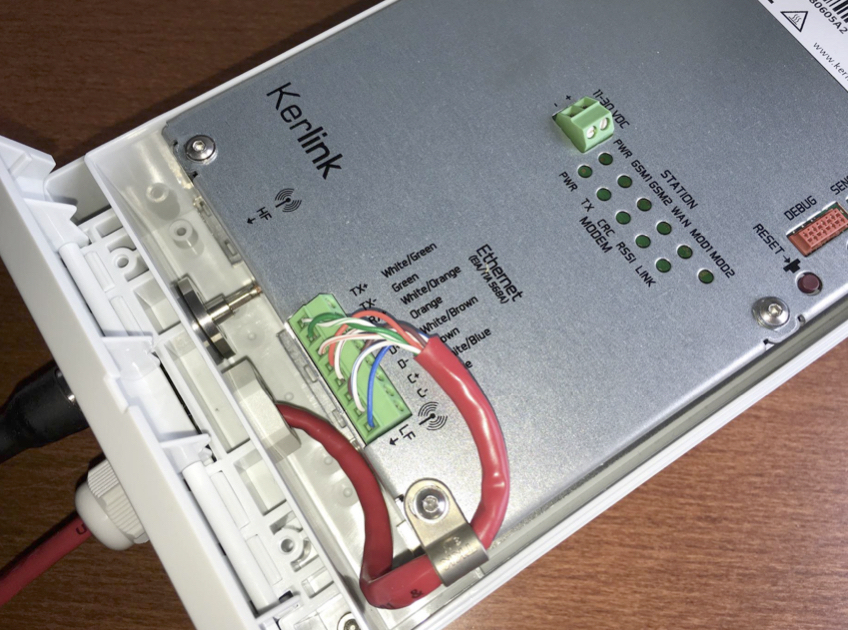
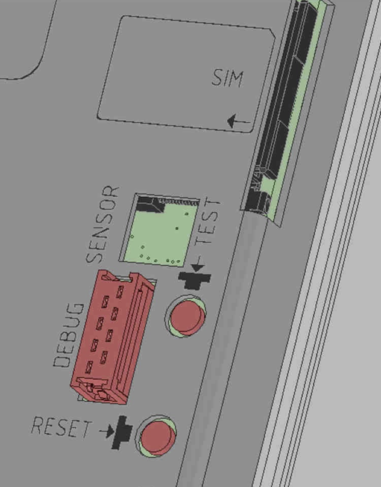

# Setup

## Main functions

### Power

The gateway get its power by PoE (Power over Ethernet) through the UTP cable or by the 11-30 volt connector on the gateway. The 11-30 volt power connector makes it possible to combine the gateway with a DC solar system. There is also a backup battery inside the gateway which can provide up to 1 min of power to ensure a safe shutdown of the gateway.

The gateway supports both the 802.3af and 802.3at PoE specifications, although there are some incompatible PoE devices: TP-Link TL-POE150S, Cisco Catalyst 3850, TP-LINK TL-SF1008P, NETGEAR FS108PEU, Laird POE-48I. The bundled PoE adapter is usually 15W, for outdoor use 30W is recommended.

### Data

The gateway can be connected to Ethernet by either a UTP connection or by a cellular 3G network.

### Antenna

It is important that the antenna is connected to the gateway before booting the gateway. Booting the gateway without an external antenna my result in permanent damage to the antenna amplifier. Depending on environment where the gateway is placed, earthing and [surge protection](../lightning-protection.md) is recommended.

## UTP cable

After unpacking the Kerlink IoT Station, open the case by putting a screwdriver in the top notch (where the antenna is located).

Connect a UTP network cable on the green connector, cable colors are noted next to the connector. You can use an existing cable by cutting of the connector of one side, or you need to make a new cable including attaching the connector (watch the coloring scheme).

Attach the UTP cable attached to the Kerlink IoT Station to the “data & power Out” port of the power adapter. Connect the “data IN” port of the power adapter to your existing network. If you use PoE switches, the power adapter is not needed.

After powering on, check your DHCP server which IP-address the gateway uses. In the rare case that your network doesn't use a DHCP server, the gateway will use the static IP `192.168.4.155`. The LEDs inside the gateway do not work by default, they only work for about a minute after shortly pressing the “Test” button. This includes the power LEDs.

Check if the gateway is on by directing a web browser to the IP-address of the gateway, for example `http://10.1.0.117` (depending on the 
given IP-address by the DHCP server). The page will show “Hello World!” if the gateway is responding.

## USB port

The USB 1.1 Type-A port is used for flashing gateway firmware.

## Debug port

The debug port can be used to attach to the Linux console of the gateway. See [Configuration](config.md) for more information.

## SIM-card

If you'd like to use a GPRS/3G connection, insert the SIM-card now.

1. Remove the SIM card holder of the Lora IoT Station by pressing the extraction button with a little screwdriver.
2. Place the SIM card in the SIM card holder.
3. Carefully insert the SIM card holder with the SIM card in the LoRa IoT Station.
4. Configure the settings for the SIM card.

