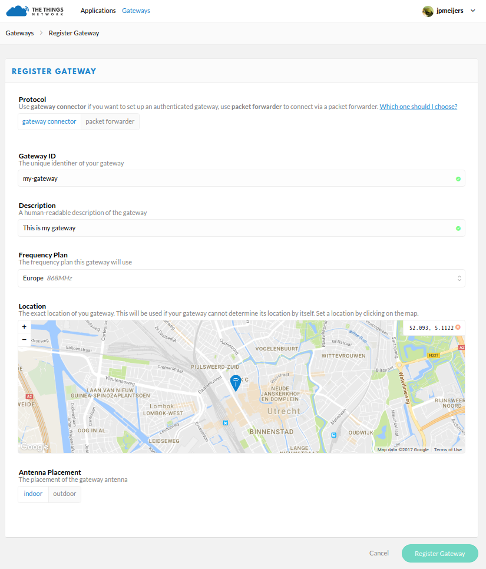

# Gateway Registration

We will transitioning to a new way to register and manage your gateways. Please read this guide carefully to understand how it currently works and what will change.

> At the moment, most gateways don't support the Gateway Connector yet. Follow [Via Bridge](#via-bridge).

## Via Connector
This is a work in process. The Things Gateway will be the first gateway to use this new procedure. Firmware and guides for other gateways will need to be updated.

> Make sure your gateway supports [The Things Network Gateway Connector](https://github.com/TheThingsNetwork/ttn-gateway-connector) before you continue.

### Start with Registration
You start by [registering your gateway](https://console.thethingsnetwork.org/gateways/register) in the Console.

- For **Activation Method**, leave **connector** selected.
- For **Gateway ID**, choose a unique ID of lower case, alphanumeric characters and nonconsecutive `-` and `_`.
- Select the frequency plan (determined by your region) the gateway uses.
- Click to drop the pin at the exact location (pan and zoom in before you drop).
- Click **Register Gateway** to finish.

  This will take you to the Gateway's screen where you'll find the generated **Gateway Key** you need next.

> After registering the gateway, select **Settings** from the top right menu on the Gateway screen so set the gateway description, location altitude, privacy settings and other information.

### Configure with new Gateway Connector
You then configure the gateway with the ID and Key from the registration. This allows you to manage most of the gateway's configuration from the Console.

> If your gateway does not have a GPS module we advise you not to configure a manual location in the gateway. Do this in the Console instead so that you can change it without accessing the gateway.

### Untrusted & Unmanaged Gateways
If you don't register your gateway or use the key to activate it, The Things Network will still accept the packages, but mark them as **untrusted**. The gateway will appear on the [map](https://www.thethingsnetwork.org/map) as **Unregistered** or **Unactivated**. If it is unregistered you will not be able to manage its configuration (e.g. location) form the Console.

## Via Bridge

### Start with Configuration
Following your gateway's guide, you start by configuring your gateway to forward packages to The Things Network, likely using [our fork of the Semtech Lora network packet forwarder](https://github.com/TheThingsNetwork/packet_forwarder). The guide should also help you set or retrieve the gateway's EUI, likely the Mac address of the LoRa module which looks like `B827EBFFFE87BD11`.

> If your gateway does not have a GPS module we advise you not to configure a manual location in the gateway. Do this in the Console instead so that you can change it without accessing the gateway.

### Bridge
We have a special bridge in place that will continue to accept packages from gateways that don't use the new Gateway Connector. It will lowercase the EUI and prefix it with `eui-`. So a gateway with EUI `B827EBFFFE87BD11` will appear in meta data and APIs as `eui-b827ebfffe87bd11`.

### Register 
[Register your gateway](https://console.thethingsnetwork.org/gateways/register) via the console. This will link it to your account so that you can manage it.

- For **Activation Method**, select **bridge**.
- For **Gateway EUI**, paste your gateway's EUI (8 bytes).
- Select the frequency plan (determined by your region) the gateway uses.
- Click to drop the pin at the exact location (pan and zoom in before you drop).

> After registering the gateway, select **Settings** from the top right menu on the Gateway screen so set the gateway description, location altitude, privacy settings and other information.

### Unregistered Gateways
If you don't register your gateway, The Things Network will still accept messages it forwards, but mark them as **untrusted**. The gateway will appear on the [map](https://www.thethingsnetwork.org/map) as **Unregistered**. You will not be able to manage its configuration (e.g. location) form the Console.

## Troubleshooting & FAQ

### Could not register gateway
If you return to the Gateways screen without seeing the newly registered gateway you will probably also see the following error on the top right:

This means someone else already registered this Gateway ID or EUI. If you registered to use the connector, simply think of a new ID. If you registered to use the bridge, check the manual of your gateway to see if you can configure it with a [different EUI](https://www.randomlists.com/string?length=16).

### How can I switch from bridge to connector?
You can't. Once the Gateway Connector is available for your gateway, you will need to reconfigure it as a new gateway and delete the old registration.
