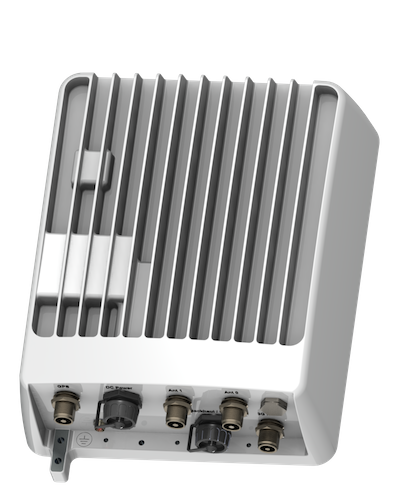
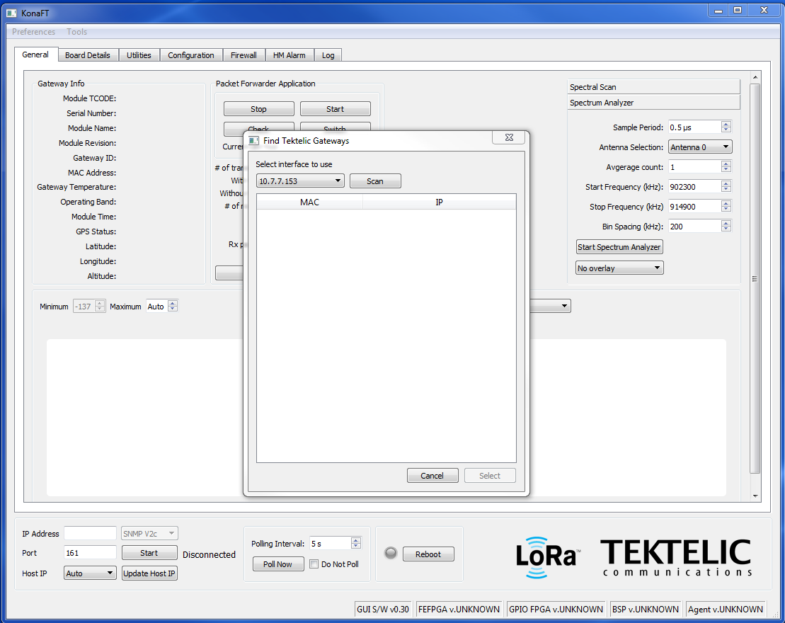
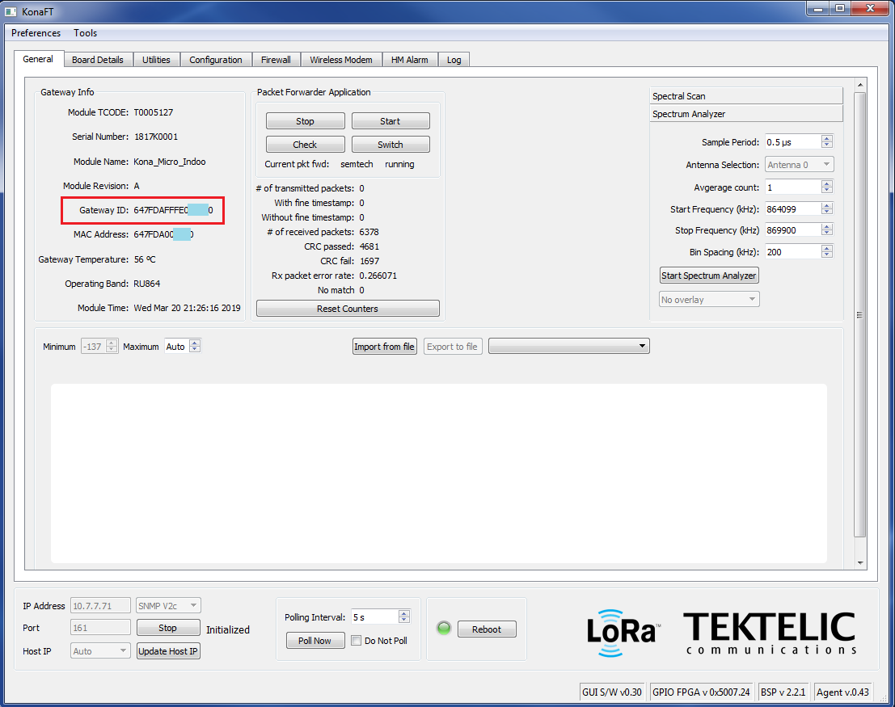
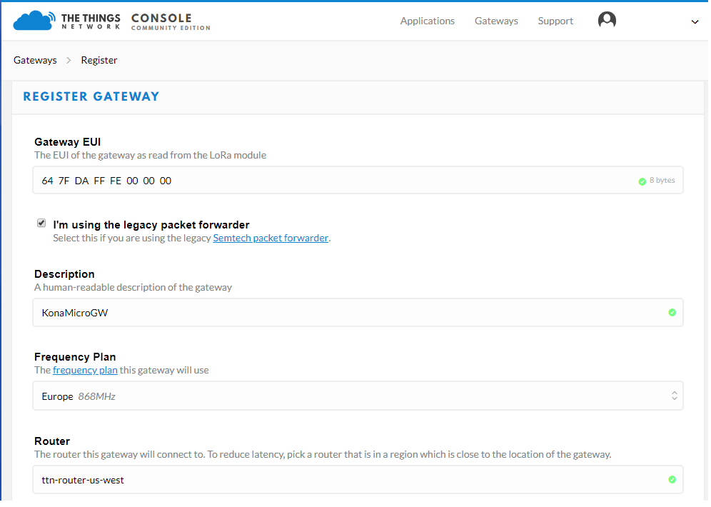
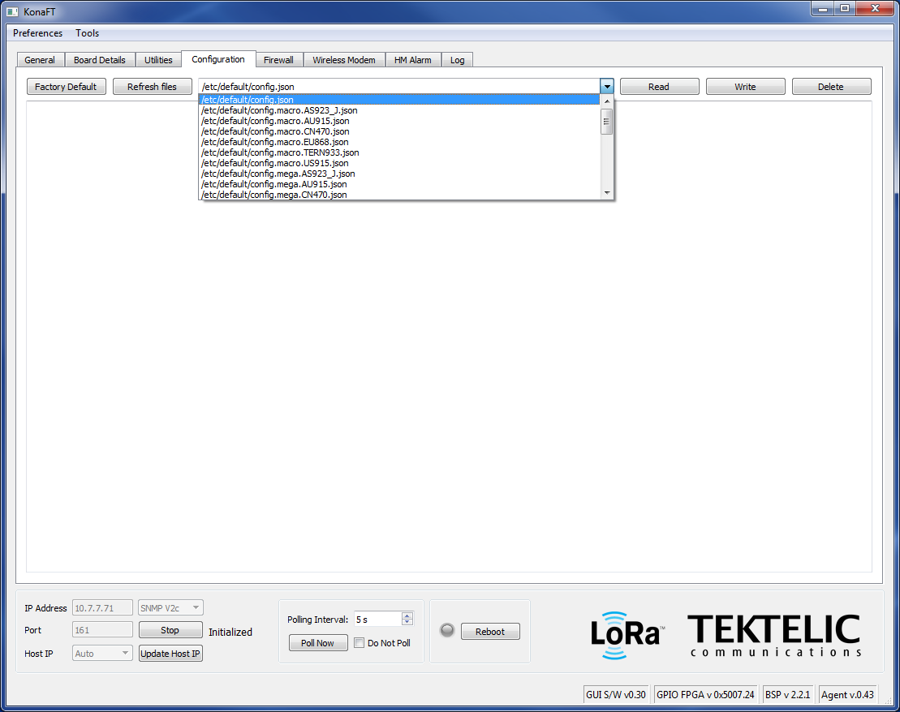
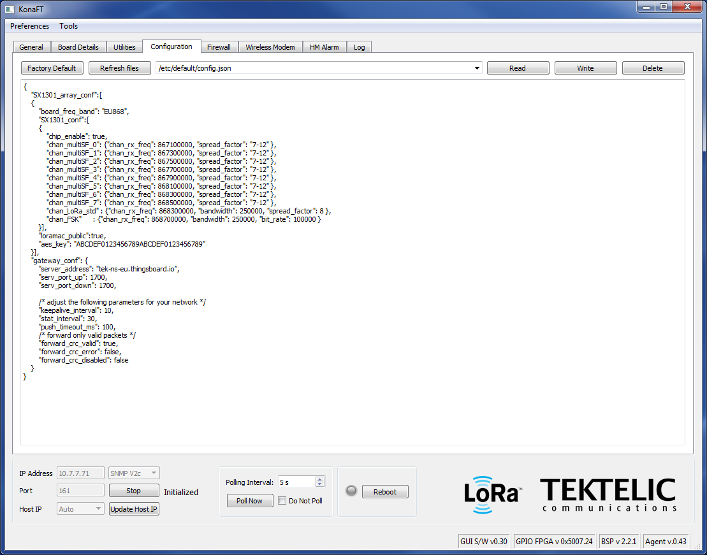
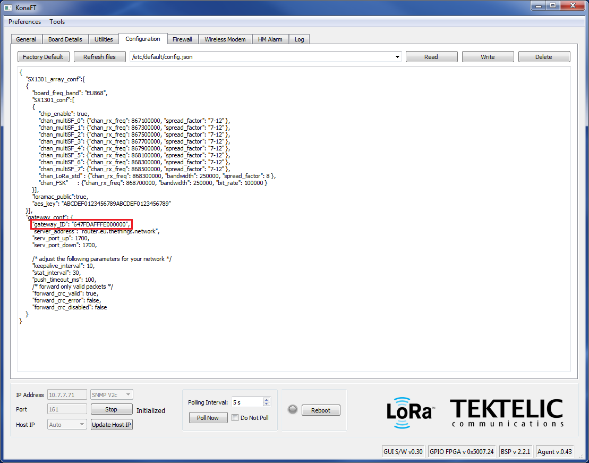

# KONA Mega IoT Gateway

TEKTELIC's KONA Mega IoT Gateway provides network operators with a carrier grade product for the deployment of LoRaWANTM Internet of Things networks. The Gateway enables massive scalability in a compact form factor by supporting up to 12 million messages per day.  

It is ideal for public and private network operators that require Full Duplex, multiple Rx and Tx Channels, cost effective and reliable LoRaWANTM gateways to maximise their network investment for years to come.

## Provisioning on TTN Network Server

This application note outlines the procedure to provision a Kona Gateway on The Things Network (TTN) Network Server.

### 1.1 Required Equipment

- Computer running Windows XP/7/10
- Kona Micro/Macro/Mega Gateway
- Power source
- KonaFT software self-extracting installer
- Cat 5/5e/6 Network cable

### 1.2 Gateway Setup

 1. Connect the Ethernet ports of the gateway and computer as illustrated below.
 2. Copy the KonaFT self-extracting installer software onto the computer then double-click on the installer icon to start the installation process.
 3. Apply power to the Kona Gateway (refer to product specific user&#39;s guide).  Boot up time of the Gateway is approximately 2 minutes. During boot up, the LED status is Flashing Green.
 4. The Kona Gateway supports DHCP on the Ethernet port. The Gateway MAC address is printed on the Gateway label. Using KonaFT and the MAC address determine the IP address of the Gateway.
 - In KonaFT select **Tools** , then select **Find My Gateway** , then press **Scan**. When scanning is complete click then entry that corresponds to the Gateway&#39;s MAC address and press **Select**.
 
 5. The Gateway&#39;s IP address should appear in the bottom left corner of the KonaFT GUI.  Ensure the port number is set to 161 (default), then select the Start button.
 6. Take note of the Gateway ID.  This information is required for registering the gateway on the Network Server.
 

### 1.3 Registering the Gateway on TTN

 1. Create a new TTN account or login to your previously created TTN account.
 2. Click the dropdown arrow next to the User, and select **CONSOLE**.
 3. Select **Gateways** , and then select **Register Gateway**.
 4. Under Gateway ID, check the Legacy Packet Forwarder checkbox.
 5. Under Gateway EUI, enter the 8 byte gateway ID recorded in one of the previous steps.
 6. Under Description add a human readable description of the gateway.
 7. Select a frequency plan from the dropdown box that corresponds to the frequency band supported by the Gateway.
 8. Select a router, picking the one that&#39;s closest to the physical location of the gateway to reduce latency.
 9. Add location and antenna placement if desired (optional).
 
 10. Click **Register Gateway**.

### 1.4 Configuring the Gateway to connect to TTN

 1. From KonaFT select the **Configuration** tab.
 2. Press the **Refresh files** button and then select **config.json** from the drop down menu.
 
 3. Press the **Read** button.
 
 4. Edit the config.json file to update the server\_address (router address) to point the gateway to the correct router.  Refer to [https://www.thethingsnetwork.org/docs/gateways/packet-forwarder/semtech-udp.html](https://www.thethingsnetwork.org/docs/gateways/packet-forwarder/semtech-udp.html).
 
 5. Add the Gateway ID (EUI).
 
 6. Press **Write** to save the changes to the config.json file.
 7. Reboot the Gateway.
 8. The Gateway should now connect to The Things Network.
