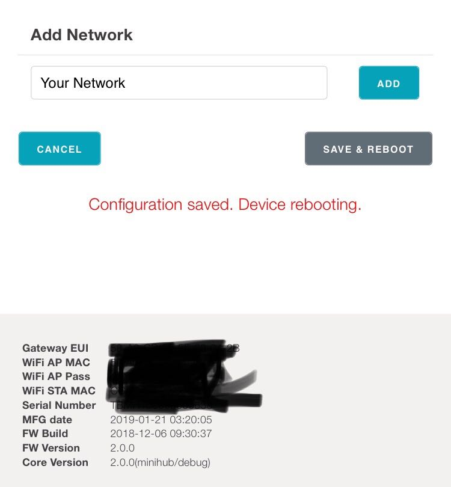

# Frequently Asked Questions

This page consolidates some of the most frequently asked questions on [The Things Indoor Gateway](./index.md).

> This section contains the most frequent issues and queries pertaining to the The Things Indoor Gateway. If you find issues that are not covered in this page, feel free to reach out to [The Things Network community forum](https://www.thethingsnetwork.org/forum).

**Q. What is the right way to register the gateway in the TTN console?**

Since this is a EUI based gateway, select the `I'm using the legacy packet forwarder` option while registering the gateway and add your 64bit (8byte) EUI in the `GatewayID` tab. The console automatically prepends lower case `eui-` to your ID. 
If registering using `ttnctl`, please follow the convention of `eui-<your 64bit EUI in lower case for the hex alphabets>`.

**Can I use any browser to configure the gateway?** 
The WiFi config page has a small JS issue when working with Firefox. Chrome will work just fine. There will be an automatic firmware update soon that will fix this.

**Q. I don't live in Europe or in the US, can I still use the gateway?**

Currently, the gateway only supports the EU868 and US915 frequency plans. Near the end of Q1, all frequency plans will be supported.

**Q. How do I know if my Gateway is EU868 or US915?**

Please have a look at the serial number on the back of your gateway.
TMBH100**868**xxxxxx -> EU
TMBH100**915**xxxxxx -> US

**Q. Is registration in TTN Console required?**

Yes the registration is mandatory. For now, these gateways are identified as US915/EU868 based on their EUIs and a default frequency plan is sent out. But, with the official V3 support, you can select other supported frequency plans while you register your gateways as you would do with other gateways currently.

**Q. How can I get the EUI of my gateway?**

The EUI of the gateway is NOT the WiFi MAC address printed on the back of the gateway but is derived from the first number on the top of the sticker below the QR code.This number can also be obtained from the WiFi Setup Page
    
To derive this take the code for example *5BA0CB80042B* and insert *FFFE* to after the first 6 characters to make it a 64bit EUI such as *5BA0CBFFFE80042B*. This is the value to be entered in the Gateway ID field on the [console](https://console.thethingsnetwork.org).
