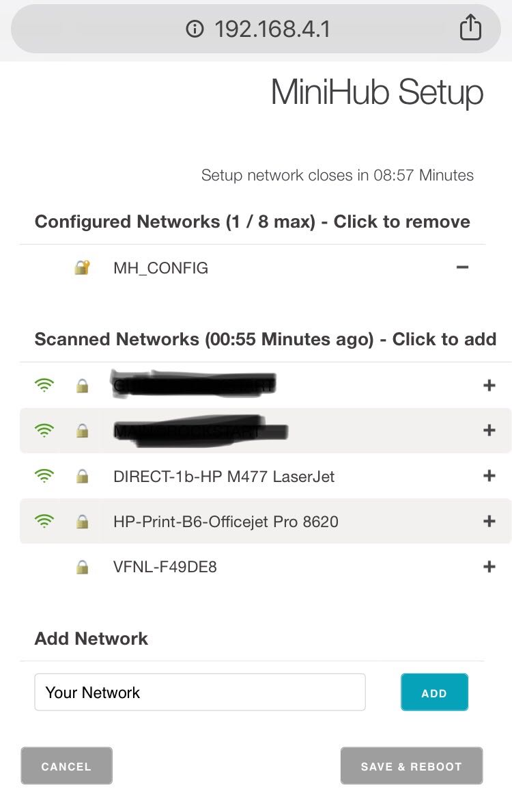

# The Things Indoor Gateway

The Things Indoor Gateway(TTIG) is designed to be a fully compliant, ultra low-cost LoRaWAN gateway, with WiFi as the backhaul. The gateway comes with a wall plug, and can be powered over USB-C on 900mA, making the gateway even suitable for applications that require dynamic coverage.

**Salient Features:**
* An 8 channel LoRaWAN indoor gateway at a price of $69. 
* One of the first gateways to support the state-of-the-art [BasicStation](https://doc.sm.tc/station/) Protocol.
* Supports LBT.
* Simple setup steps taking lesser than 5 mins.
* Can connect to any network backend of choice.
* Setup and Connectivity over WiFi.
* Can be powered up via a USB-C cable or via an elegant connector to the power outlet.
* Built-in omnidirectional antenna for indoor use.
* EU868, US915, AS923 and CN470 versions available.
* Security via a range of [modes](https://doc.sm.tc/station/authmodes.html).

## Activate your gateway in under 5 min

1. Press the reset button (small button at the back of the gateway next to the USB-C port) for 5 seconds until the LED blinks rapidly GREEN<->RED for a couple of times.
2. Hold the SETUP (button at the top of the gateway, next to the LED) for 10 seconds until the LED blinks rapidly in RED.
3. The gateway now exposes a WiFi AP whose SSID is *MINIHUB-xxxxxx* where xxxxxx is the last 6 digits of the gateway ID.
4. The password for this network is printed on the back panel of the device under *WiFi PW*.
5. After connecting to this network go to *192.168.4.1* using a web browser to access the WiFi config page.

6. Select the WiFi network and enter the password if it's a closed network.
7. Select the "Save and Reboot" option.
8. If your config is right, 
   * The gateway will blink GREEN for a few seconds while it connects to this network.
   * Then, it will blink GREEN<->RED for a few seconds while it connects to the [CUPS](https://doc.sm.tc/station/cupsproto.html) endpoint and fetches the necessary information to connect to the [LNS](https://doc.sm.tc/station/tcproto.html) traffic endpoint.
9.  If your configuration was successful, the LED will be solid GREEN which means that the gateway is connected to the LoRaWAN network and is ready to handle packets.

## Connection to the The Things Network Backend

1. To connect this gateway to the The Things Network console, register the gateway using the *I'm using the Legacy Packet Forwarder* option. 
2. The EUI of the gateway is NOT the WiFi MAC address printed on the back of the gateway but is derived from the first number on the top of the sticker below the QR code.
   * This number can also be obtained from the WiFi Setup Page
    
3. To derive this take the code for example *5BA0CB80042B* and insert *FFFE* to after the first 6 characters to make it a 64bit EUI such as *5BA0CBFFFE80042B*
4. This is the value to be entered in the Gateway ID field on the [console](https://console.thethingsnetwork.org).
5. Enter in other details such as location, frequency plan and router.
6. If your configuration was successful, you should start receiving packets (if there are LoRaWAN nodes transmitting nearby).

## Operating Modes

### Configuration Mode (CONF)

* In this mode, the device acts as a WiFi AP to which users can connect and configure a WiFi network(s) to which the gateway will connect to during normal operation. The device cannot route LoRaWAN packets in this mode.

### Gateway Mode (GW)

* In this mode, the device acts as a gateway to route traffic between the LoRaWAN Device and the Network. The WiFi AP for configuration is not available in this mode.

## LED states

|Color(s) | Illumination Pattern |Operating Mode | Meaning|
|---|---|---|---| 
|GREEN|Blinking (freq 1 sec)|GW| WiFi not connected (or trying to connect)|
|GREEN|Blinking (freq 1/4 sec)|GW| Connected to WiFi, establishing connection to LNS/Configuring radio|
|GREEN|Solid|GW| Connected to WiFi, connected to LNS backend, listening for Packets|
|GREEN/RED|Alternate Blinking (freq 1/4 sec)|CONF| Scanning WiFi networks, setting up Config AP|
|RED|Blinking (freq 1/4 sec)|CONF| Config AP Active|

## Button Actions

There are three possible button actions on the TTIG
* SETUP Button pressed for 10s: 
  * Switch to CONF mode if in GW mode.
* SETUP Button pressed for 5s:
  * Reboot if in CONF mode, do nothing in GW mode.
* RESET Button pressed for 5s:
  * Factory reset (wipe out WiFi and LNS credentials, though CUPS credentials are retained).

