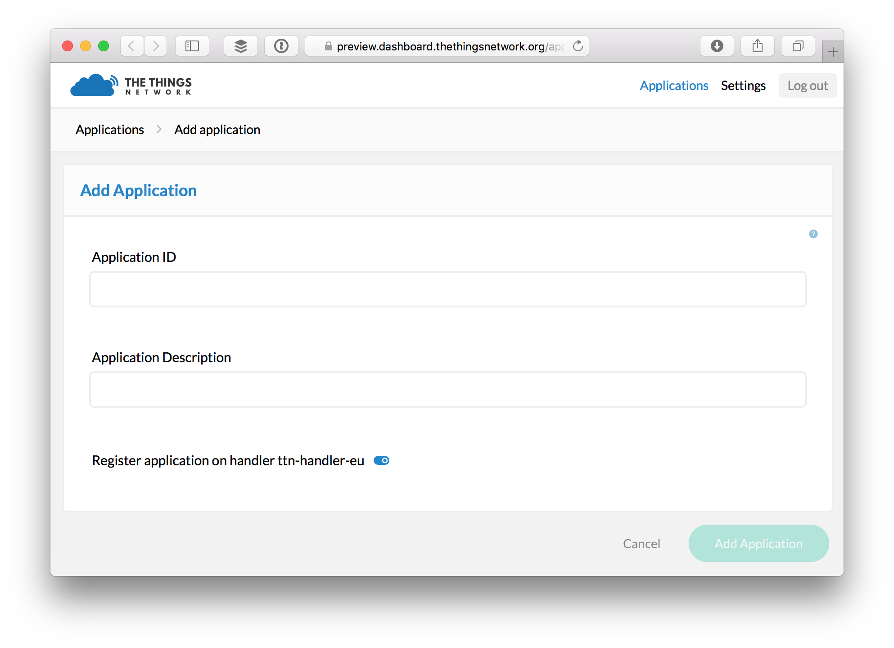
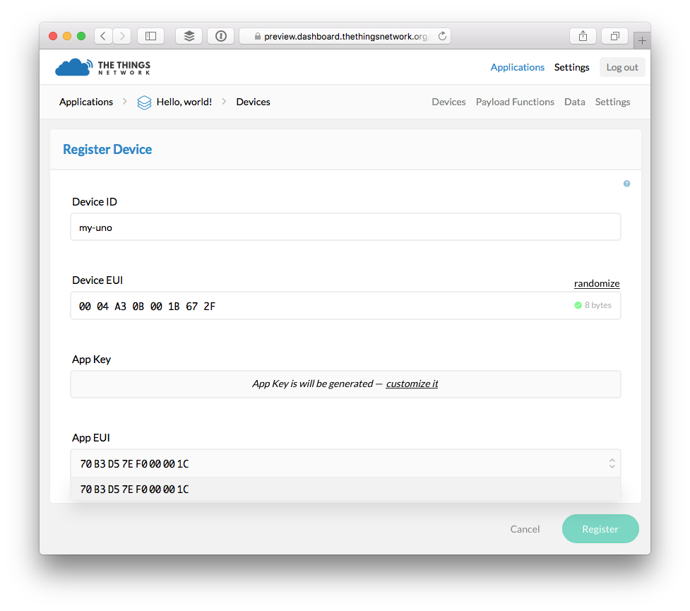

# Migration Guide

This guide will walk you through migrating applications and devices from [staging.thethingsnetwork.org](https://staging.thethingsnetwork.org/) to [preview.console.thethingsnetwork.org](https://preview.console.thethingsnetwork.org/).

> The migration does not require any changes to devices that use OTAA (the default). Devices that use ABP will need their sketch to be updated with a new Device Address.

<div class="alert alert-warning"><strong>Warning:</strong> This version of the backend is in preview. The database with registered application and devices might be reset before it goes in production.</div>

<div class="alert alert-warning"><strong>Warning:</strong> Messages will be routed to the new backend automatically once you have migrated a device and will no longer be delivered to staging. You will have to delete a migrated device to use staging again.</div>

## Applications

For each application you'd like to migrate:

1.  On [staging](https://staging.thethingsnetwork.org/applications/), click the application you'd like to migrate to see the **Application Info** box.
2.  In [preview](https://preview.console.thethingsnetwork.org/applications/), go to [add application](https://preview.console.thethingsnetwork.org/applications/add).
    - For **Application ID**, use anything you like as long as it is unique and only uses low case alphanumeric charachters and nonconsecutive `-` and `_`.
    - For **Application Description**, copy the **Application name** from staging.

    

3.  From the **Application Overview** page of the newly created application, click **Settings** on the top right.
4.  In the box **EUI**, click **remove** right of the **App EUI** that was generated for you.
5.  Click the **add EUI** or **Add one!** link.
    - Copy-paste the **App EUI** from the **Application Info** box on staging.

    

### Payload Functions

If you have customized the payload functions you'll need to migrate those as well:

1.  On staging, in the **Application Info** box click **edit** after **Payload Functions**.
2.  In preview, click **Payload Functions** on the top right.
3.  For each of the Payload Functions you have customized, copy-paste the function body from staging to preview and click **Save**.

    > You might notice the default payload functions are no longer anonymous, but you can just paste the anonymous functions from staging.

## Devices

For each device you'd like to migrate:

1.  On [staging](https://staging.thethingsnetwork.org/applications/), click the application you'd like to migrate devices from.
2.  In the **Devices** box click the **Dev EUI** of the device you'd like to migrate to see its **Device info** box.
3.  In [preview](https://preview.console.thethingsnetwork.org/applications/), click the [migrated application](#applications) to go to its **Application Overview** page.
4.  Click **Devices** on the top right.
5.  Click **register device**.
    - For **Device ID**, use anything you like as long as it is unique and only uses alphanumeric charachters and nonconsecutive `-` and `_`.
    - For **Device EUI**, click **customize it** and copy-paste the **Dev EUI** from staging.
    - For **App Key**, click **customize it** and copy-paste the **App Key** from staging.
    - For **App EUI**, click to select the **App EUI** from staging which you added when you [migrated the application](#applications).

    

> Made a mistake? You can always come back to the devices and click **Settings** on the top right to change all of the above settings, except the **Device ID**.

### Devices registered for ABP

If you had your device registered for ABP, follow these additional steps:

1.  Navigate to the registered device if you're not there already after registering it.
2.  Select **Settings** from the top right menu.
3.  Click the **personalize device** link aligned right of the **Device Settings** header.
    - For **Network Session Key**, click **customize it** and copy-paste the **Network Session Key** from staging.
    - For **App Session Key**, click **customize it** and copy-paste the **App Session Key** from staging.
4.  Connect the device.
5.  Update the following line of your sketch with the generated **Device EUI**:

    ```c
    const char *devAddr = "00000000";
    ```
