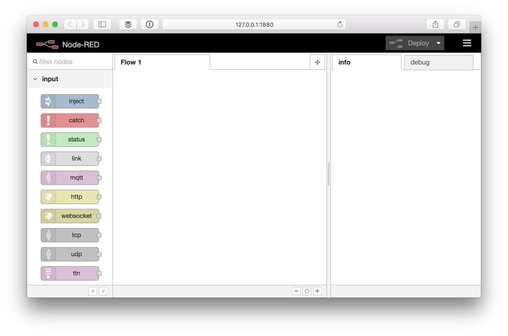

# Setup
To get started we need to install Node-RED and add the TTN node, both via [NPM](https://www.npmjs.com/).

## Node-RED

1.  Make sure you have [Node.js](https://nodejs.org/) and then install Node-RED:

    ```bash
    sudo npm install -g --unsafe-perm node-red
    ```

    See Node-RED's [Getting Started / Installation](http://nodered.org/docs/getting-started/installation) for details.
  
2.  Run Node-RED:

    ```bash
    node-red
    ```

    See Node-RED's [Getting Started / Running](http://nodered.org/docs/getting-started/running) for details.
	
3.  Spot a line like this to know what URL to open in your browser:

    ```bash
    29 Aug 11:13:01 - [info] Server now running at http://127.0.0.1:1880/
    ```

    You should see something like:

    

## The Things Network node
    
1.  Add the TTN node:

    ```bash
    cd $HOME/.node-red
    npm install node-red-contrib-ttn
    ```
        
    See Node-RED's [Getting Started / Adding Nodes](http://nodered.org/docs/getting-started/adding-nodes) for details.
    
2.  Restart (`Ctrl+C` to stop) and re-open Node-RED in your browser.

    You should now see the **ttn** node in the sidebar:

    