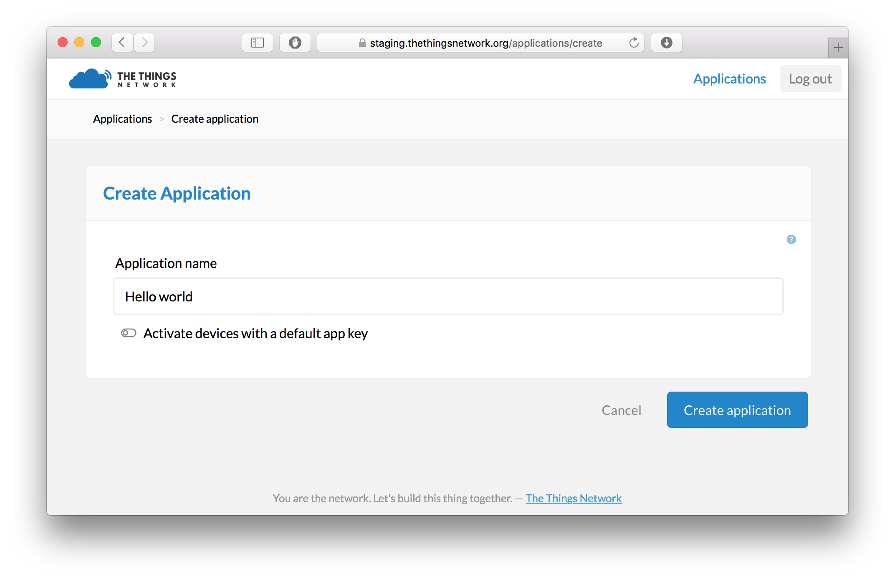
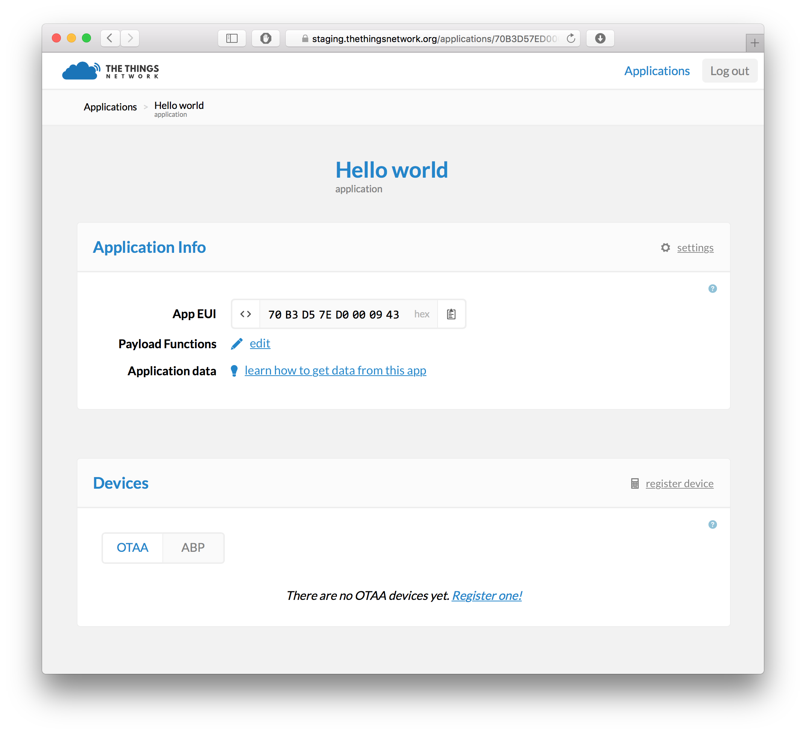
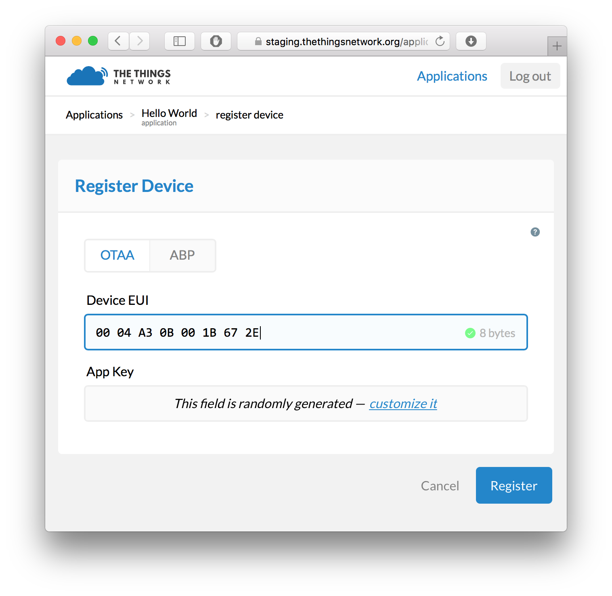
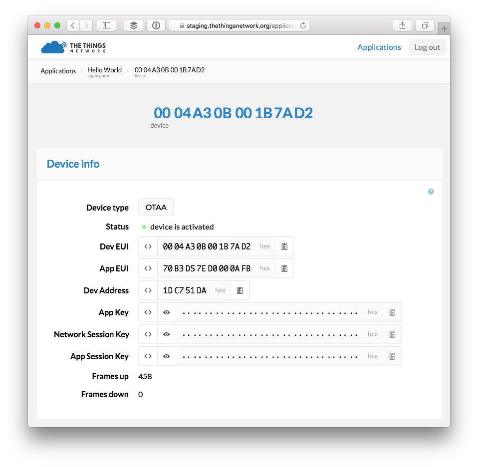

# Quick Start

This guide will walk you through programming The Things Uno to send and receive your first message via The Things Network.

## Setup Arduino IDE

1. [Download](https://www.arduino.cc/en/Main/Software) and install the latest Arduino Software (IDE).
2. Navigate to **Sketch > Include Library > Manage Libraries...**.
3. Search for **TheThingsNetwork** and click the result to select it.
4. Click the **Install** button which should appear:

  

The Arduino IDE will notify you of updates for the IDE and library automagically. :open_mouth:

> See the [Arduino Guide](/arduino/) for more details.

## Connect Device

1. Use the included Micro-USB cable to connect The Things Uno to an USB power of your computer.
2. In Arduino IDE select **Tools > Board > Arduino Leonardo**.
3. Navigate to **Tools > Port** and select the port that identifies as **Arduino Leonardo**.

If you don't see a port that identifies as **Arduino Leonardo** make sure The Things Uno's power LED is on and check the cable and USB port you have used. See [Arduino Troubleshooting](https://www.arduino.cc/en/Guide/Troubleshooting#toc16) for more suggestions.

## Get your Dev EUI

The *DevEUI* is an unique address hard coded into the LoRa module. We use this address to register a device for OTAA with The Things Network.

1.  In the Arduino IDE open **File > Examples > TheThingsNetwork > [DeviceInfo](https://github.com/TheThingsNetwork/arduino-library/blob/master/examples/DeviceInfo/DeviceInfo.ino)**.
2.  Select **Sketch > Upload** `Ctrl/⌘ + U` to upload the sketch.
3.  Select **Tools > Serial Monitor** `Ctrl/⌘ + Shift + M` to open the [Serial Monitor](/arduino/#serial-monitor).
4.  Soon, it should print a list with **Device Information**, including the **DevEUI**:

    ```
    Device Information

    EUI: 0004A30B001B672E
    Battery: 3304
    AppEUI: 0000000000000000
    DevEUI: 0004A30B001B672E
    DevAddr: 00000000
    Data Rate: 5
    RX Delay 1: 1000
    RX Delay 2: 2000

    use the device `EUI` to register the device for OTAA
    ```

## Create Application
Messages to and from devices are routed via applications.

1. On the dashboard, click [create application](https://staging.thethingsnetwork.org/applications/create).
2. Enter an **Application name**.
3. Click **Create application**.



You will be redirected to the newly created Application page where you find the App EUI and can proceed to register devices.



## Register Device
Devices need to be registered with an application in order to send and receive messages via it.

1.  In the **Devices** section of the Application page, click **register device**. 

    

2.  On the **Register Device** screen leave **OTAA** selected.

    > See the [Dashboard / Register Device](/dashboard/#register-device) guide for more details on OTAA and its alternative ABP.

3.  Enter the **Dev(ice) EUI** you obtained earlier. When the format is correct, the **Register** button should become enabled.
4.  Leave the **App Key** to be randomly generated.
5.  Click **Register** to finish and get redirected to the device page:

    

## Activate Device
Now that you have registered the device you need to activate it from the device itself.

1.  In Arduino IDE, select **File > Examples > TheThingsNetwork > [SendOTAA](https://github.com/TheThingsNetwork/arduino-library/blob/master/examples/SendOTAA/SendOTAA.ino)**.
2.  Copy the **App EUI** and **App Key** from the device page to the example.

    > Use <code><i class="fa fa-eye"></i></code> to show obfuscated keys and <code><i class="fa fa-code"></i></code> to toggle to **msb**. Then use <code><i class="fa fa-clipboard"></i></code> to copy.
    >
    > 

    For OTAA, the example calls `ttn.join()` with the `appEui` and `appKey` you declared.

    ```c
    // ..

    // Runs once
    void setup() {

      // ..

      // Try OTAA with pauses of 6 seconds
      while(!ttn.join(appEui, appKey)){
        delay(6000);
      }
    }
    ```

3.  Select **Sketch > Upload** `Ctrl/⌘ + U` to upload the sketch.

    > Uploads might fail if you still have the Serial Monitor open.

## Send Message (uplink)
The example you uploaded calls `ttn.sendBytes()` to send an uplink message from the device to your application on The Things Network.

Messages are arrays of bytes so you need to encode any (sensor) data you'd like to send as bytes.

```c
// Runs continuously with pauses of 10 seconds
void loop() {

  // Declare and send an array of bytes
  byte payload[] = { 0x48, 0x65, 0x6C, 0x6C, 0x6F };
  ttn.sendBytes(payload, sizeof(payload));

  delay(10000);
}
```

## Decode Message
Still on the dashboard's device page, you should see the messages coming in under the **Messages** section:


You could now use MQTT or the [TTN Node for Node-RED](/node-red/) to process the payload as it is, but we can also decode it first.

1.  Go back to the application page and click the **<i class="fa fa-pencil"></i> edit** link in the **Application Info** box.
2.  Leave **decoder** selected, paste the following JavaScript code and click **Save**.

    ```js
    function (bytes) {
      return {
        message: String.fromCharCode.apply(null, bytes)
      };
    }
    ```

3.  Go back to the application page and the next message should be decoded:

    

## Receive Message (downlink)
Now let's send a message back to the device. Devices can only receive the last message sent to them in response to a message they send themselves. This means that you need to poll The Things Network frequently to not miss any downlink messages.

1.  In the Arduino IDE, replace the call to `ttn.sendBytes()` with the following:

    ```c
    int downlinkBytes = ttn.sendBytes(payload, sizeof(payload));

    if (downlinkBytes > 0) {
      debugSerial.print("Received: ");
      
      for (int i = 0; i < downlinkBytes; i++) {
        debugSerial.print((char) ttn.downlink[i]);
      }
      
      debugSerial.println();
    }
    ```

2.  Select **Sketch > Upload** `Ctrl/⌘ + U` to upload the sketch.
3.  Select **Tools > Serial Monitor** `Ctrl/⌘ + M` to open the Serial Monitor.
4.  On the dashboard, go to the application page.
5.  In the **Devices** box click on the **Dev EUI** of your device to go to its page.
6.  In the **Downlink** box, paste the following hex-encoded list of bytes and click **Send**.

    ```
    48 69
    ```

7.  In the Arduino IDE, you should see the next succesful transmission followed up with the response:

    ```
    Sending: mac tx uncnf 1 with 5 bytes
    Successful transmission. Received 2 bytes
    Received: Hi
    ```