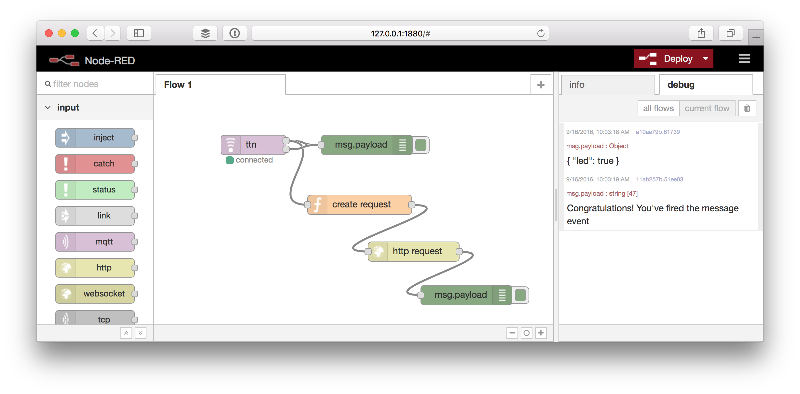
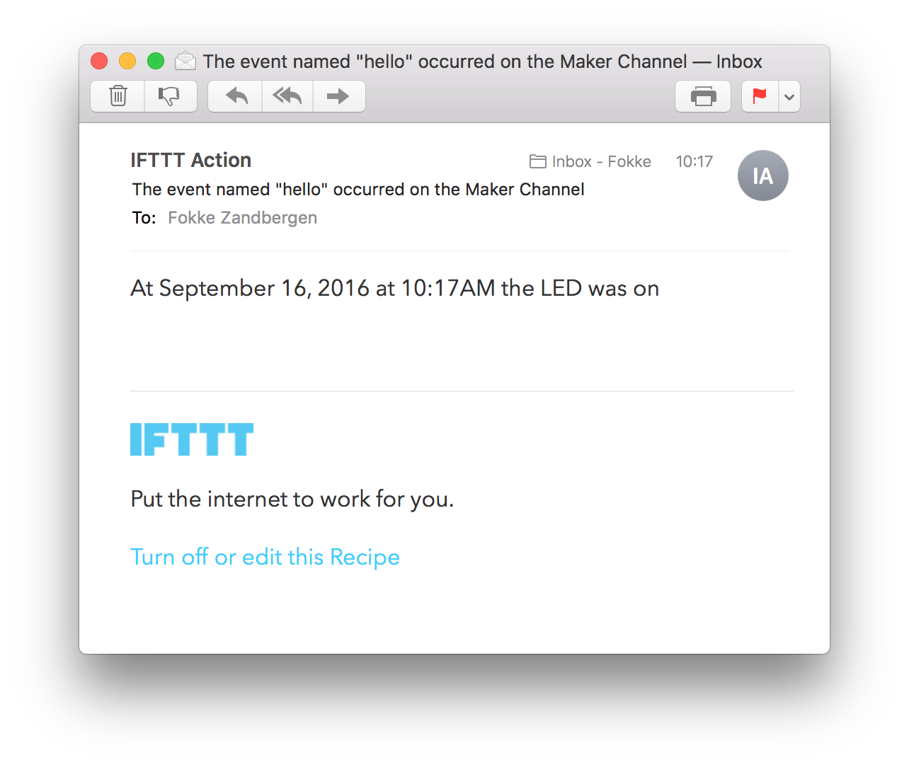

# Quick Start
In this Quick Start we will use Node-RED to forward up to 3 message fields from our device to IFTTT's [Maker Channel](https://ifttt.com/maker). Once there, we can trigger tons of services. In this example we'll use it to send us an email.

> This guide assumes the sketch and payload functions of [The Things Uno / Quick Start](/uno/#quick-start), but can be easily applied to any other.

You can find the full flow that we will build in the [Node-RED Library](http://flows.nodered.org/flow/a14cfb633c0bd093d52cab3c12297ee9).

## Create IFTTT Recipe
Let's start on IFTTT.

1.  Go to [IFTTT](https://ifttt.com) and create an account or login.
2.  Go to [Create a Recipe](https://ifttt.com/myrecipes/personal/new).
3.  Click **this** to Choose Trigger Channel.

    1.  Search for `maker`.
    2.  Click the **Maker** channel.

    The first time you'll need to click **Connect**, then **Done** in the popup that opens and finally **Continue to the next step**.
    
4.  Click **Receive a web request**.

    *  For **Event Name**, let's enter `hello`.
    
5.  Click **that** to Chose Action Channel.

    1.  Let's search for `email`.
    2.  Click the **Email** channel.

6.  Click **Send me an email**.

    *  For **Body** copy-paste:

       
       ```
       At {{OccurredAt}} the LED was {{Value1}}
       ```
       

7.  Click **Create Action**.
8.  Click **Create Recipe**.
9.  Go to the [Maker Channel](https://ifttt.com/maker) to find your key.

## Wire your Node-RED flow
If you haven't done so already, follow [Setup](#setup) and [Usage / Configure](#configure) to setup Node-RED, the TTN Node and configure it to connect to your application. I'll be here waiting for you. 😴

1.  In Node-RED, drop a new **function** on the flow from the **function** category of the toolbox.
2.  Drag a wire from the upper output of the **ttn** node to the input of the new node.
3.  Double click the new node to edit it.
4.  Enter a **Name** like `create request`.
5.  As the actual **Function** IFTTT expects a payload with `value[1-3]`.

    Building on [The Things Uno / Quick Start](/uno/#quick-start) use: 

    ```javascript
    return {
        payload: {
            value1: msg.payload.led ? 'on' : 'off'
        }
    };
    ```

    This should look something like:

    

6.  Drag a **http request** node from the same **function** category.
7.  Drag a wire from the output of the **create request** node to the input of the **http request** node.
8.  Double click the new node to edit it.
9.  As **Method** select **POST**.
10. For **URL** enter `https://maker.ifttt.com/trigger/{event}/with/key/{key}`.

    * Replace `{event}` with the **Event Name** `hello` we used at IFTTT.
    * Replace `{key}` with the key you found at the [Maker Channel](https://ifttt.com/maker).
11. Click **Done** and you should now have something like:

    

12. Click **Deploy**.

    Soon after your device sends a new message, you should see it come through in the Node-RED debug panel and arrive in your mailbox:

    

    🎉 Congratulations! You can now use both Node-RED and IFTTT to process device messages and hook up to countless of other services without writing any - well almost no - code.

13. Go to [My Recipes](https://ifttt.com/myrecipes/personal) to turn off the recipe, unless you like to be spammed. 😱
